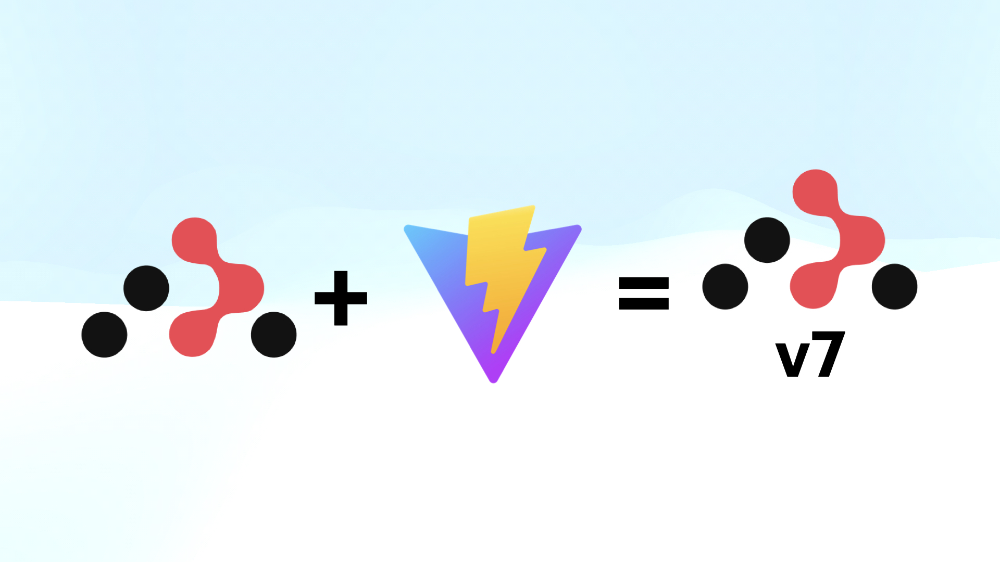
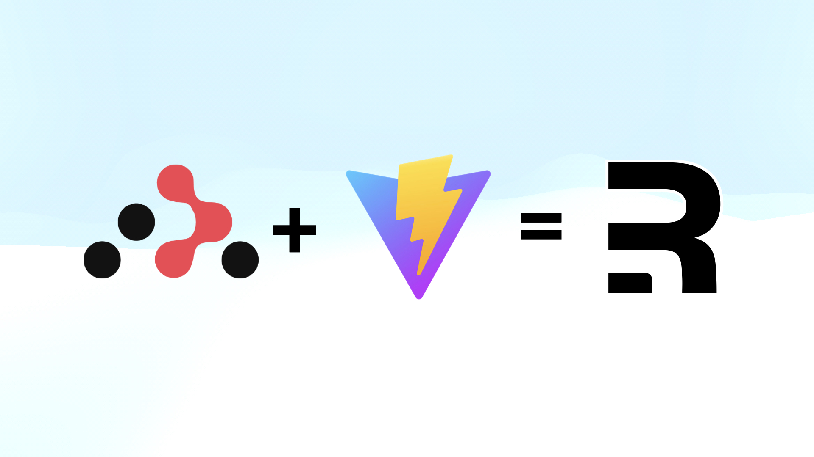

# React Router v7

Hey **React Native** Developers,

The biggest **React** Conference, organized by [**Meta**](https://x.com/Meta) and [**Callstack**](https://x.com/callstackio), wrapped up recently. It was a two-day event that started on May 15th, filled with exciting announcements.

Picture credit by [@mattcarrollcode](https://x.com/mattcarrollcode)

**A piece of good news is that [Ryan Florence](https://x.com/ryanflorence)** has introduced the world to **`React Router V7`**. In this new version 7, the **`Remix`** team has integrated **`Vite Plugin`** (a modern front-end build tool) with **`React Router`**. As a result, if you are using React Router V7 in your project, all these features will become available to you.

- Automatic code splitting
- Simplified data loading
- Form Actions, Server actions
- Simplified pending states
- Optimistic UI (UI acts before server confirms action)
- Server rendering
- Static pre-rendering (Builds static pages early for speed/SEO)
- RSC (React Server Component) coming soon

To know more about it, let’s first understand what React Router is.

### The React Router

**`React Router`** is the core library that provides the fundamental building blocks for routing in React applications. It contains components like **`Route`**, **`Switch`**, and **`Router`** that are essential for managing routes in any React project.

**`react-router-dom`** is the library that react team uses as the default routing library in react projects. It includes everything from **`React Router`** plus more features that are useful for web applications (Ex: **`BrowserRouter`** and **`Link`**).

Both **`React Router` & `react-router-dom`** were built by the [**Remix**](https://x.com/remix_run) team.

### Vite Plugin for Remix

In October 2023, the remix team integrated **`Vite`** with **`Remix`** (a **full-stack web framework** built on top of **`React Router`**). Then, in February 2024, the team announced **Vite Plugin** as stable in Remix v2.7.0.

At this point, **`Remix`** is just a **`Vite plugin`** that makes **`React Router`** more convenient to use and deploy. Outside of the plugin, **Remix** pretty much just re-exports **React Router**.

### The React Router V7

After integrating **Vite Plugin** with **Remix** **framework**, the team observed that **`React Router`** is already being used by more than **7 million** projects and **5 million** lines of the Shopify app. Therefore, the team didn’t want the developers of these projects to have to rewrite code to import **`Remix`** to achieve the features listed above.

So, they again took a new plan to help these millions of developers by remixing **`React Router`**. They just integrated **`Vite Plugin`** with **React Router** which means React Router is getting everything great about Remix (and more!) in the V7.
