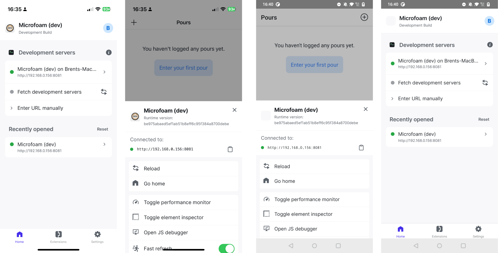
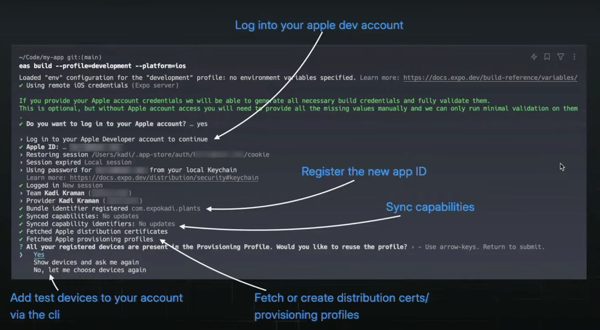
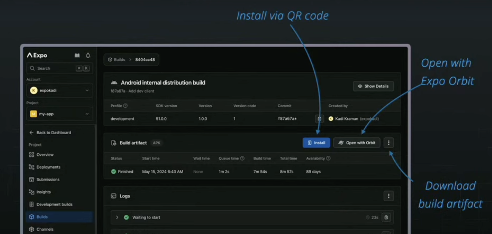

# 𝝠 Expo workflows: Expo Go, Dev builds, prebuild, CNG, EAS, Orbit

$\textcolor{chocolate}{\text{Posted on Jun 27, 2024}}$

Hey **React Native 🩵** Developers,

The [**Expo**](https://x.com/expo) team has made mobile app development super interesting by providing multiple ways to build your **React Native** app. You can build your app locally or even in the cloud using [**EAS (Expo Application Services)**](https://expo.dev/eas). Additionally, you can build your app by only writing JS code through [**Expo Go**](https://expo.dev/go) or by writing both JS code and Native Code through the [**Development Build**](https://docs.expo.dev/develop/development-builds/create-a-build/). Furthermore, you can run and build your app (or APK) or any web demo projects (snacks) on a real device, simulators, or emulators in just under 5 seconds using [**Expo Orbit**](https://docs.expo.dev/build/orbit/).

Today, we will dive deep into all these tools that Expo provides for building a React Native app 🚀.

- Expo Go
- Development Build
- Expo Dev Client and prebuild
- EAS Build
- Expo Orbit

**CREDITS:** A big thanks to [**Kadi Kraman**](https://x.com/kadikraman) and [**Gabriel Donadel**](https://x.com/donadeldev) for their amazing talks on these topics at [**App Js Conf 2024**](https://x.com/appjsconf).

# Expo Go

**Expo Go** is a React Native app development tool that lets you write native apps without any native builds tool (Xcode, Android Studio) installed on your device.

It is basically a native app with a whole bunch of native capabilities & debug tools included by default & already published in the App & Play Store. To build a native app by using Expo Go, you need to first [**download the Expo Go app**](https://expo.dev/go) from the store & then just run the javascript bundle (JS code) locally on a local dev server without having any native tooling setup.

### Limitations of Expo Go

1. Expo Go has a bunch of native modules access (Ex: **`expo-camera`**) but it can’t support all the other native libraries that exist in the community (Ex: **`react-native-vision-camera`**).
2. Expo Go can’t bundle (collect all the necessary code) native libraries that require custom inputs from the user, such as **`react-native-firebase`**. Because the Expo Go app includes a bundle of all supported native modules (e.g., **`expo-camera`**). However, when a native module depends on user inputs, the bundle code also changes.
3. If a library publishes a new fix or new changes, then **Expo Go** needs to recreate a new bundle with those fixes and changes. This means developers need to wait until a new release of Expo Go is available, which includes the latest bundle with those fixes in the library.

**NOTE:** With all the limitations of Expo Go (mentioned above), the Expo team does not recommend using Expo Go for production. Instead, they have built a new mechanism called ‘Development Build,’ which fixes all the problems mentioned earlier.

# Development Build

A **development build** is a debug build of your app that contains the `expo-dev-client` package (a library that has various development tools and is handy for local development). By using development builds instead of **Expo Go**, you achieve full control over the native runtime, so you can install any native libraries, modify any project configuration, or write your native code. With Expo **development builds**, you are building your own native app, while with **Expo Go** you are running your project in a sandboxed (limited) native app environment.

### Expo dev client

The `expo-dev-client` package replaces the default in-app development tools UI that React Native provides with a more powerful and extensible in-app UI, adds support for network debugging, and adds a launcher UI like below.



### Convert an Expo Go project to a Development Build

From the above, we already learned that “**Development Build**” includes **`expo-dev-client`**. So, to convert an **Expo Go** project into a **development build**, you need to install **expo-dev-client** by running the below command.

```bash
npx expo install expo-dev-client
```

Then you need to generate native code for iOS and Android using the command below. In an **Expo Go** project, there are no **`/android`** and **`/ios`** directories. However, for a **‘development build’,** you need these directories with the necessary native code. To generate native code, the below **`prebuild`** command uses **CNG (Continuous Native Generation)** which uses app config & app JSON files to create native codes.

```bash
npx expo prebuild
```

After the generation of native code, you can use the below commands to run the Android & iOS apps in your device or simulator.

```bash
# For andoid
npx expo run:android

# For ios
npx expo run:ios
```

**NOTE:** To run the **development build** in Android you need to have **Android Studio** & in iOS you need to have **Xcode** installed in your local machine.

# EAS build

By using **‘Development Build’** instead of **‘Expo Go’,** you need to have Android Studio and Xcode installed on your local machine. However, the Expo team wanted to make this easier for developers. Therefore, they introduced a new web service called **EAS (Expo Application Services)** to build the app in the cloud.

### EAS (Expo Application Services)

EAS is a cloud service that helps you build, develop, and deploy React Native apps. It provides a **CLI tool** to trigger builds in the cloud. It helps developers by removing major pain points of React Native app development by automatically generating a **key store** for Android, creating **provisioning profiles** for iOS, and performing many other tasks. The **EAS CLI** makes the process fully automatic and can be completed within a minute, as compared to manual work that takes more than an hour.

Below is the screenshot provided by [**Kadi Kraman**](https://x.com/kadikraman), where she executed the **EAS build** command using the **EAS CLI** to build the native iOS app in the cloud.



In the above screenshot, she showed us that the **EAS CLI** had been triggered to start building an iOS app in the cloud. At first, the CLI asked to log into the Apple Developer account, then it registered the APP ID automatically since it was a brand-new app that had never been built before. Then, the capabilities got synced (e.g., Checking for Push Notifications, Apple Payment, etc.) automatically. After that, **distribution certificates** and **provisioning profiles** are fetched or a new one will be created so that you can reuse it later. Finally, the **EAS CLI** tool registers any new devices via the terminal. Just amazing, everything has been done automatically. 🙌

So, after the EAS build, you can open the app either by using a QR code (for a real device) from [expo.dev](http://expo.dev) or Expo Orbit (for simulators and emulators).



# **The Magic of Expo Orbit 🚀**

Before **Orbit**, installing **development builds** or **updates from EAS** (on Android and iOS physical devices or emulator/simulator) or running Snack projects on simulators was manual & time-consuming.

For instance, to install a **development** **build**, first, you need to download the archive from the builds that you created. Next, open the iOS simulators from Xcode and then drag and drop it into the simulator (in the case of iOS). A demo of it was shown by [**Gabriel Donadel**](https://x.com/donadeldev) in App Js Conf 2024.


Similarly, to install **Snack projects**, additional steps need to be followed like installing **Expo Go** on the virtual device, then logging in using the expo credentials, and then selecting the Snack from the list. Ahh, lots of pain to run a simple **Snack** project 😞.


All of these complicated and lengthy processes daily are too much 🤦.

### Expo Orbit in action 🚀

Recently, the [**Expo**](https://expo.dev/) team released [**Expo Orbit**](https://docs.expo.dev/build/orbit/) (a macOS menu bar app that enables one-click build launches, and simulator management) **V1.0** in November 2023. Then in March of this year, they released **V1.1**, which supports launching **EAS Updates** (live app updates for a cloud build) directly in Android Emulators and iOS Simulators. Lastly, just a couple of days ago, [**Gabriel Donadel**](https://x.com/donadeldev) announced that from now on, **Expo Orbit** will also be supported on **Windows & Linux** (still in the [**Pre-release**](https://github.com/expo/orbit/releases/tag/expo-orbit-v2.0.0-preview.1) phase).

So, **Expo Orbit** makes all of the steps mentioned above as seamless as possible. As mentioned earlier, It is now very simple to launch your Android emulators and iOS simulators using Expo Orbit from the menu bar, as shown below.


### Installing Dev Builds by Expo Orbit

Also, now users can launch their builds from the website (Cloud builds) to Expo Orbit in a very easy manner, as shown below.


With this significant progress, the Expo team announced that Expo Orbit speeds up by **10x** when installing builds 🔥.

### Installing Snack projects by Expo Orbit

Similarly, you can also open **snack projects** using Expo Orbit within a couple of seconds, as shown below.


### Installing EAS Updates

Additionally, Expo Orbit can now install EAS updates (live app updates for a cloud build) from expo.dev on your devices or simulators, as shown below.


### Expo Orbit now supports multi-platforms 🚀

Besides macOS, Expo Orbit now also supports **Windows** and **Linux** in V2.0, which is still in the pre-release (experimental) phase. For Windows, it currently only supports x64 and x86 machines. Compatibility for other architectures will be available soon! Below is shown how Expo Orbit runs on Windows.


### Install Expo Orbit

I hope that, with all the magic of Expo Orbit mentioned above, you are interested enough to install it on your device today. To install on macOS, use the following command.

```bash
brew install expo-orbit
```

**NOTE:** You can download Orbit for **Windows** directly from the [GitHub releases](https://github.com/expo/orbit/releases/tag/expo-orbit-v2.0.0-preview.1).

# That's All 🙋‍♂️

I hope you enjoyed reading it. It would be really great if you could consider giving it a [**STAR**](https://github.com/anisurrahman072/React-Native-News-2024) ⭐️.

# About Author 👷‍♂️

I'm Anis, **Sr. React Native Engineer** and the author of [**React Native Advanced Guide Book**]() with **1.7K STAR** ⭐️. Over 5 years in **React Native** and **Full Stack**, I’ve built numerous production-grade apps. You can **[🩵 CONNECT me in X](https://twitter.com/anis_RNCore)** for any consultation.
