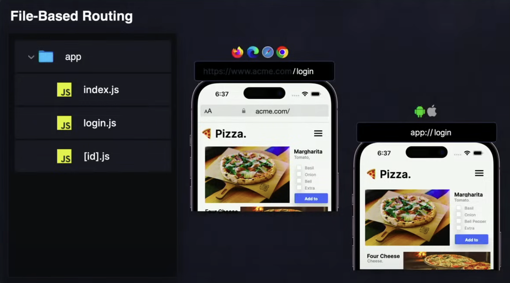
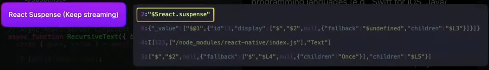
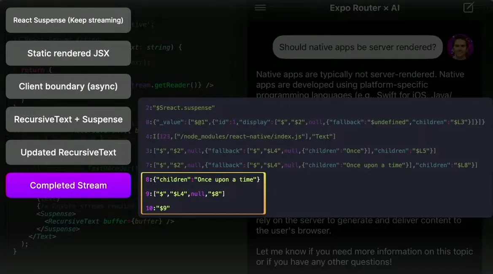

# RSC (React Server Components) now in All Platform By Expo Router 🔥

Hey **React Native** Developers,

The biggest **React** Conference, organized by [**Meta**](https://x.com/Meta) and [**Callstack**](https://x.com/callstackio), wrapped up recently. It was a two-day event that started on May 15th, filled with exciting announcements.

Picture credit by [@mattcarrollcode](https://x.com/mattcarrollcode)

So, the most exciting news from **React Conf 2024** is that [**Evan Bacon**](https://x.com/Baconbrix) from the [**Expo**](https://x.com/expo) team has introduced **React Server Components** across all platforms (web, desktop, mobile) via the **Expo Router**.

To learn more about this talk, let’s first understand what the Expo Router is.

### The Expo Router

Expo Router is the first file-based routing system to build react apps that run on both web & native platforms.

With the help of **Expo Router**, the RSC server can handle multi-platform requests. When a request is made from an iOS or Android device, or even from a web browser, the server recognizes the platform and renders the appropriate version of the server components.

### Server-driven UI: RSC

There are some mobile apps (e.g., Lyft, Netflix, Reddit) that implement a server-driven UI in their native applications, which can be quite complex to configure. They are using some common architecture such as JSON (a static UI representation by HTML for a custom native application). However, this JSON does not facilitate **user interaction** with the UI.

Here, **RSC** (React Server Components) **has** advanced this concept by directly sending JSX components from the server to the client (web, desktop, or mobile device) to handle user interactions.

### RSC with Expo Router

The main goal of Expo Router is to make this server-driven UI interactive for developers. Below, we see three mobile applications that were showcased at the conference.

1. **ChatGPT 4 App:** It utilizes a server-driven UI with JSON. Since JSON is a static UI representation, it does not allow users to interact with the UI (e.g., clicking a button to reveal more data about an image).
2. **Gemini AI App:** It is the same as the ChatGPT 4 application.
3. **Expo Router AI App:** It also uses Server-driven UI but with an RSC data pattern (where server sends directly JSX code to the client device). This enables users to interact with the UI seamlessly. For instance, Evan Bacon demonstrated this by performing a long press on an image, which then opened a menu. Moreover, the RSC data pattern allows for the integration of native access, such as scheduling a date in the calendar, with the rendered JSX component.

.gif>)

In the Expo Router AI app, we observed Evan Bacon demonstrating a Map view (below). This Map view is a client component because it relies on the Native API. However, all the data for this Map was fetched on the server, and the carousel at the bottom, which we also received, was rendered using a React Server Component.

 (1) (1).gif>)

**`NOTE:`** The RSC server sends only JavaScript code to the client. It does not transmit any native bindings or native code (for example, Calendar API, Map API, etc.) to the client’s device.

Now, let’s learn a bit about the data pattern that RSC uses.

### RSC data pattern

When a **client** (web or mobile device) requests the Server then an **`RSC payload`** (static representation of the JSX code) is sent back with suspense (**loading components**) to keep the stream open.

These are the key points that an **RSC payload** carries and executes during the stream’s progress:

1. It carries the root **`JSX code`** in a static representation (JSON) format.
2. It then carries a **`URL`** that contains only the **client code** **(Client JS bundle),** which is necessary for RSC to load (hydrate) to be interactive for handling user actions.
3. Subsequently, it carries the currently rendered **`UI element`** (Ex: Text element). React’s Suspense feature is used here to ensure that the server can keep sending updates to the client (Ex: At first server sent **“Once”** and then sent **“Once upon a time”**). As more data is sent from the server to the client, the page or screen can keep updating with new content by updating the react tree. This continuous update process enables the client application to respond instantly to user interactions, resulting in a seamless experience.
4. Finally, once the stream is complete, React will terminate the connection.

Below is the final data pattern illustrating how the **RSC server** transmits data to the client (web, desktop, or mobile), as presented by **Evan Bacon** on stage.

