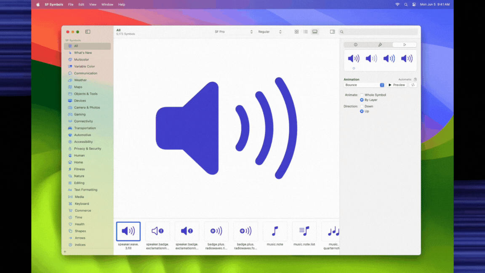
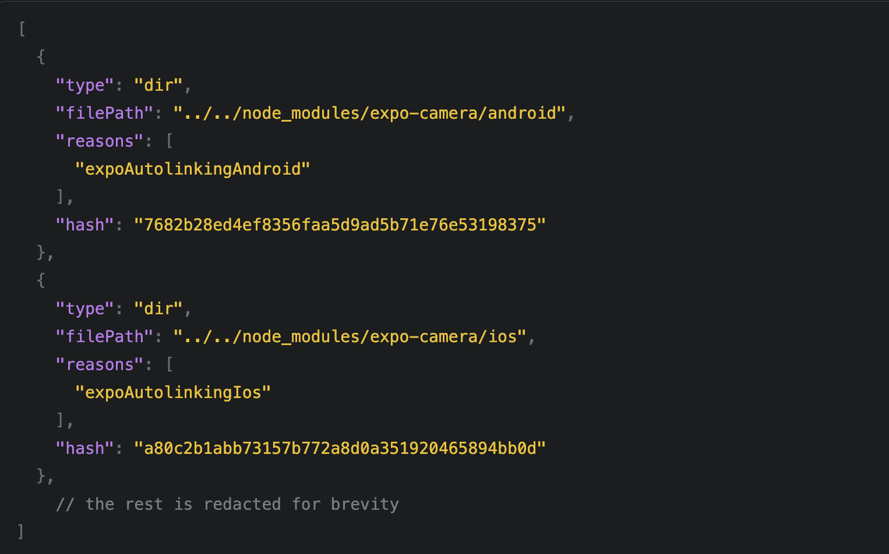
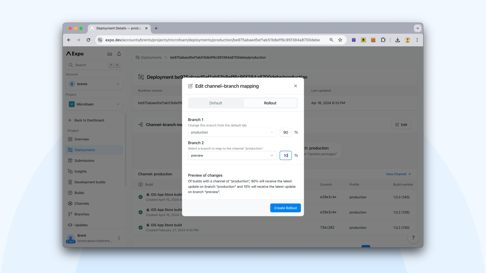
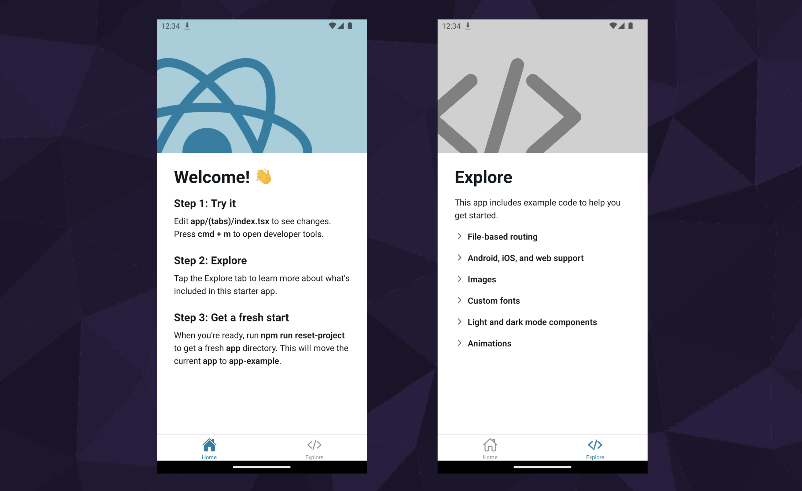

# 🚀 What’s new in 𝝠 Expo SDK 51?

$\textcolor{chocolate}{\text{\textbf{Posted on May 16, 2024}}}$

Hey **React Native 🩵** Developers,

𝝠 [**Expo**](https://x.com/expo) team has just released **SDK 51**, packed with amazing features and improvements, including **React Native V0.74**. Let’s dive into a quick introduction with major highlights!

1. **Added support for Bridgeless Mode**
2. **"Next" Camera and SQLite APIs are now the defaults**
3. **New and improved Video package.**
4. **Introducing `expo-symbols`**
5. **Fingerprint runtime version policy promoted from experimental to beta**
6. **Expo Router v3.5**
7. **EAS Update: Rollout new web UI**
8. **New project template 🚀**


# **Added support for Bridgeless Mode**

As **React Native V0.74** has been **included** in **Expo SDK 51**, and React Native V0.74 has introduced **bridgeless mode as the default** setting when enabling the new architecture, **Expo SDK 51** now also defaults to bridgeless mode with the new architecture. The Expo team mentioned that nearly all **`expo-*`** packages in the Expo SDK now support the New Architecture, including bridgeless.

Expo team worked in close collaboration with the React Native team at Meta and developers in the React Native ecosystem to ensure there would be support for the New Architecture in many of the most commonly used packages on EAS (Expo Application Services) Build.

Additionally, they expect that they will be able to enable the New Architecture by default in SDK 52.

# **"Next" Camera is the default now**

In the 50th version of Expo SDK, the Expo team introduced a new version of the camera library called **`expo-camera/next`**. This new version updates the old and widely used **`expo-camera`** library to meet the latest standards and best practices of the underlying operating systems. It’s a modernized update of the camera feature for app developers using Expo.

However, from SDK 51, the Expo team has made **`expo-camera/next`** the default camera API. To establish it as the default, they have updated the **`import`** statement for the Expo camera API.

```jsx
// SDK 50
import { Camera } from "expo-camera"; // Legacy API
import { CameraView } from "expo-camera/next"; // Modern API

// SDK 51 (Update the import to the following if you were using "next" API)
import { CameraView } from "expo-camera"; // Modern API

// SDK 51 (Update the import to the following if you were using "Legacy" API)
import { Camera } from "expo-camera/legacy"; // Legacy API
```

Before moving on to the next enhancements, let’s get a quick update on what has been improved in the new camera API ‘next’.

### The **expo-camera/next**

The new **expo-camera/next** made several improvements over legacy **expo-camera** API

1. Re-written Android implementation using `CameraX` API (Recommended API by Google).
2. Improved barcode scanning reliability.
3. Made most configuration options available through props.

# **“Next” SQLite API is the default now**

Another piece of good news is that **`expo-sqlite/next`** also has now become the default in Expo SDK 51, which has made significant improvements over the legacy **`sqlite`** package.

Here’s what’s new and better:

1. It’s designed to make the API more similar to the well-established databases used for websites and Node.js (Ex: **MySQL**, **PostgreSQL**).
2. This API is based on **SQLite version 3.45.3** and includes both synchronous (sync) and asynchronous (async) methods, which means it can perform database operations both sequentially and concurrently.
3. It now supports **prepared statements** (pre-compiled SQL commands), **update callbacks** (functions that run after a database update), the **Blob data type** (used to store binary data), and allows for **custom build flags** (special settings) for SQLite, along with other improvements.

Similar to camera, the expo team has updated the **`import`** statement for the Expo **`sqlite`** package.

```jsx
// SDK 50
import * as SQLite from "expo-sqlite"; // Legacy API
import * as SQLite from "expo-sqlite/next"; // Modern API

// SDK 51 (Update the import to the following if you were using "next" API)
import * as SQLite from "expo-sqlite"; // Modern API

// SDK 51 (Update the import to the following if you were using "Legacy" API)
import * as SQLite from "expo-sqlite/legacy"; // Legacy API
```

# **New and improved Video package**

The expo team is excited to announce the **beta release** of the **new expo-video library**, starting from Expo SDK 51. This release follows the successful introduction of the ‘next’ Camera and SQLite APIs. The **expo-video** library is a thorough revamp of the video functionality previously found in `expo-av`. It has been redesigned to be more reliable and user-friendly.

# **Introducing `expo-symbols`**

The team has introduced expo-symbols (currently an iOS-only package) that provides access to the **iOS SF Symbols library**, which is a collection of over 5000 icons. These icons come with multiple weights, scales, and support for animations, making them highly versatile for use in mobile app development.

### **The specialty of “expo-symbols”**

One of the special features of **`expo-symbols`** is the ability to perform **variable color animations**. This means you can draw attention to a symbol by changing the opacity of the symbol’s layers, either **cumulatively** (where each change in opacity is added to the previous, resulting in a gradual build-up) or **iteratively** (where each change in opacity is applied one after the other in a sequence, often looping back to the start).



# **Fingerprint of native runtime**

In Expo SDK 51, the **Fingerprint runtime** version policy has been promoted from experimental status to beta. Let’s understand details about it.

### What is **Fingerprint?**

Fingerprint is a **hash value** (a long string of numbers and letters) that represents the exact state of your app’s native code at a certain point in time. When you make changes to the native code, you get a new “fingerprint” for the updated code.

A real-life use case occurs when you install an npm package with native dependencies, the app creates a new fingerprint. For example: `npx expo install expo-camera` (for expo-based app) or `npm install react-native-vision-camera` (for bare react native app).

### **@expo/fingerprint in action**

The new **`@expo/fingerprint`** package fully supports projects made with [Expo CLI](https://docs.expo.dev/more/expo-cli/) and also works with any [bare React Native apps](https://docs.expo.dev/bare/overview/) to detect any changes in native code. By running **`npx @expo/fingerprint@latest /path/to/yourProject`**, you can get a full picture of your project's native setup. Notice that it will identify what changed, for example, if you installed **expo-camera,** you will see something like this.



### Why **@expo/fingerprint?**

The creation of `@expo/fingerprint` provided answers to all these questions from community:

- Does a pull request include native code changes and need to initiate a new build for testing?
- Is my update compatible with the runtime in my production app? Or will it crash the app?
- Does a project require a [development build](https://docs.expo.dev/develop/development-builds/introduction/), or can I experiment with it in Expo Go?

# **Expo Router v3.5**

Expo Router v3.5 primarily addresses bug fixes and enhancements based on community feedback. Some of the major improvements include:

- **Support for the # segment in URLs**: The **`useLocalSearchParams()`** hook now allows you to extract the hash segment from URLs. This is useful when you want to navigate to a specific section of a page.

```jsx
const { "#": hash } = useLocalSearchParams();
```

- Added new router functions for **dismissing routes** (go back to one or many screens of a stack). Dismiss is different from `back`, as dismiss targets the closest stack, not the current navigator.
  - `router.dismiss()`: To return to the previous screen in the closest stack.
  - `router.dismissAll()`: To return to the first screen in the closest stack. This is similar to [popToTop](https://reactnavigation.org/docs/stack-actions/#poptotop) stack action.
  - `router.canDismiss()`: To check if it is possible to dismiss the current screen. Returns **true** if the router is within a stack with more than one screen in the stack's history.
- Added support for creating route and **\_layout** files that are specific to different platforms (e.g., iOS, Android, web).

# **EAS Update: Rollout new web UI**

With **SDK 50**, the Expo team introduced **‘rollouts’** (**gradual updates**). This feature lets you update your app for some users first, which helps prevent bugs from affecting everyone at once. Initially, this could only be done using **EAS CLI**. Now, with **SDK 51**, the Expo team has provided an easy-to-use online tool that makes managing these updates more straightforward.



# **New project template 🚀**

The Expo team has simplified the process of beginning development with **SDK 51**. When you start a new project using **`npx create-expo-app`**, you’ll be introduced to a **refreshed and updated project template**. This template already includes all the necessary dependencies and settings that most projects require, allowing you to start working on your project immediately without any delays.



# That's All 🙋‍♂️

I hope you enjoyed reading it. It would be really great if you could consider giving it a [**STAR**](https://github.com/anisurrahman072/React-Native-News-2024) ⭐️.

# About Author 👷‍♂️

I'm Anis, **Sr. React Native Engineer** and the author of [**React Native Advanced Guide Book**]() with **1.7K STAR** ⭐️. Over 5 years in **React Native** and **Full Stack**, I’ve built numerous production-grade apps. You can **[🩵 CONNECT me in X](https://twitter.com/anis_RNCore)** for any consultation.
.
