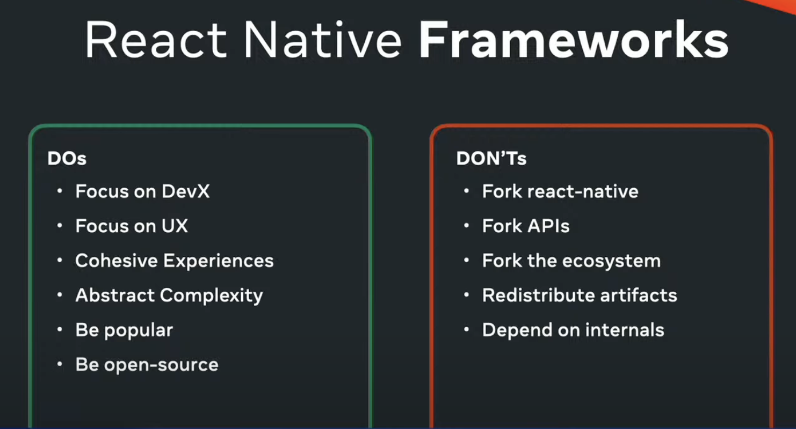

# Rules of React Native Frameworks 👷‍♂️

$\textcolor{chocolate}{\text{\textbf{Posted on Jun 6, 2024}}}$

Hey **React Native 🩵** Developers,

One of the biggest and most exciting conferences, [**App Js Conf 2024**](https://appjs.co/) on **React Native**, organized by [**Software Mansion**](https://x.com/swmansion) with [**Expo**](https://x.com/expo) as the main partner, has recently concluded. The three-day event started on May 22nd, filled with exciting talks. One of the most exciting talks was on **❝ Rules of React Native Frameworks ❞**. Today, we will explore more details about it! 🚀

$\textcolor{crimson}{\text{\textbf{NOTE:}}}$ If you want to learn more about all the exciting talks at [**App Js Conf 2024**](https://appjs.co/), then read my detailed [**article (news)**](https://github.com/anisurrahman072/React-Native-News-2024/blob/master/React-Native-Conference-Talks/App-Js-Conf-2024.md) on it.

# Back to Stage

So, [**Nicola Corti**](https://x.com/cortinico) from **Meta’s React Native team** clarified on stage the key responsibilities of **React Native core** and **React Native frameworks**. He also recalled a quote from [**React Conf 2024**](https://github.com/anisurrahman072/React-Native-News-2024/blob/master/React-Native-Conference-Talks/React-Conf-2024.md).

# React Native Core VS Frameworks

The **core** refers to the React Native SDK (latest version 0.74), and **React Native frameworks** are the toolbox with all the necessary APIs to let you build production-ready apps. (Ex: Expo). **Nicola** presented a clear and detailed chart of the responsibilities of these two modules.

In the image above, you see two parts: the **Frameworks** (top section) and the **Core** (bottom section), each with the features they must provide. He also mentioned that **Expo** (a React Native framework) provides all the features specified in the above image (top section), which is why the official React Native documentation now recommends using **Expo** as a React Native framework.

Side by side he mentioned two methods for building a library for React Native.

1. Build a library for React native **Framework** (Ex: For Expo)
2. Build a library for React Native **Core** (Ex: TurboModules)

# Rules of React Native Frameworks

Although **Expo** exists, if anyone wishes to create a **React Native Framework** and have it recommended by the official React Native team, they must follow certain rules as shown below. Nicola primarily emphasized one point: **‘Do not fork the react-native core to create a React Native Framework.’**

# When to build a new React Native Framework?

The React Native core team has recommended these use cases for when you can build your own React Native Framework, only if you’re:

1. **Pro** at native development and needs something unique that other frameworks don’t offer.
2. **A React Native expert** and want to adjust it to suit your company’s way of doing things.
3. **Aiming** to adapt React Native for new platforms, like visionOS.
4. **A company** that has special needs, like legal or licensing issues, that prevent using available frameworks.

# That's All 🙋‍♂️

I hope you enjoyed reading it. It would be really great if you could consider giving it a [**STAR**](https://github.com/anisurrahman072/React-Native-News-2024) ⭐️.

# About Author 👷‍♂️

I'm Anis, **Sr. React Native Engineer** and the author of [**React Native Advanced Guide Book**]() with **1.7K STAR** ⭐️. Over 5 years in **React Native** and **Full Stack**, I’ve built numerous production-grade apps. You can **[🩵 CONNECT me in X](https://twitter.com/anis_RNCore)** for any consultation.
