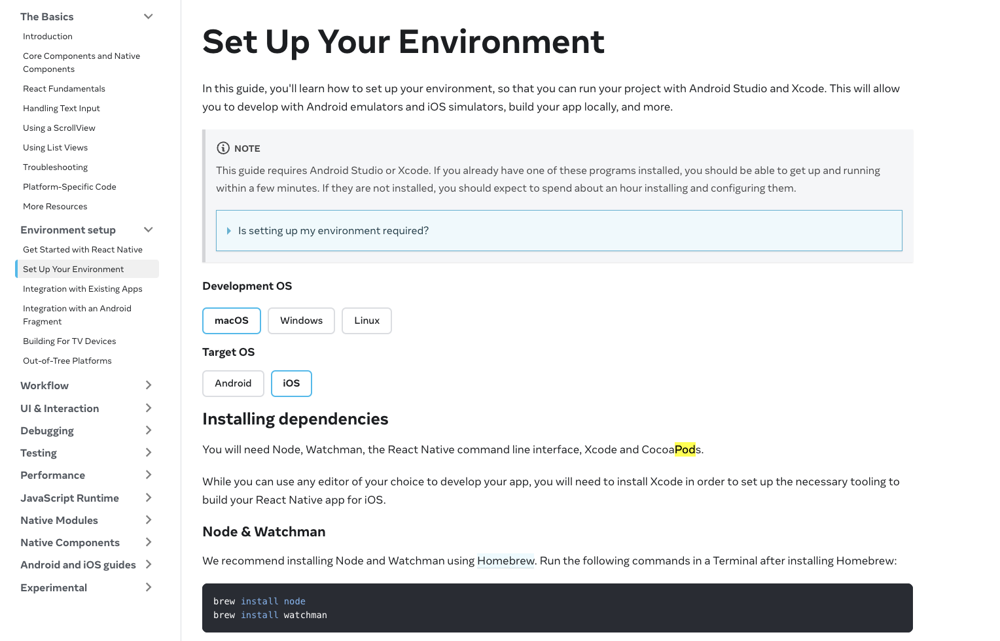
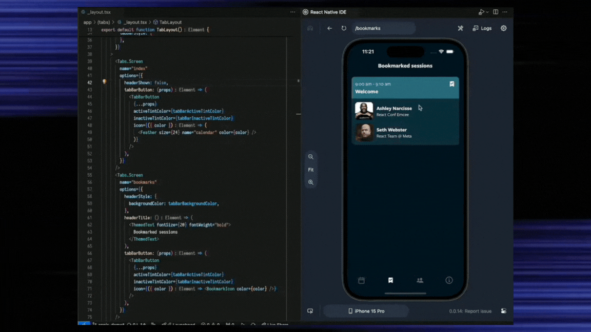
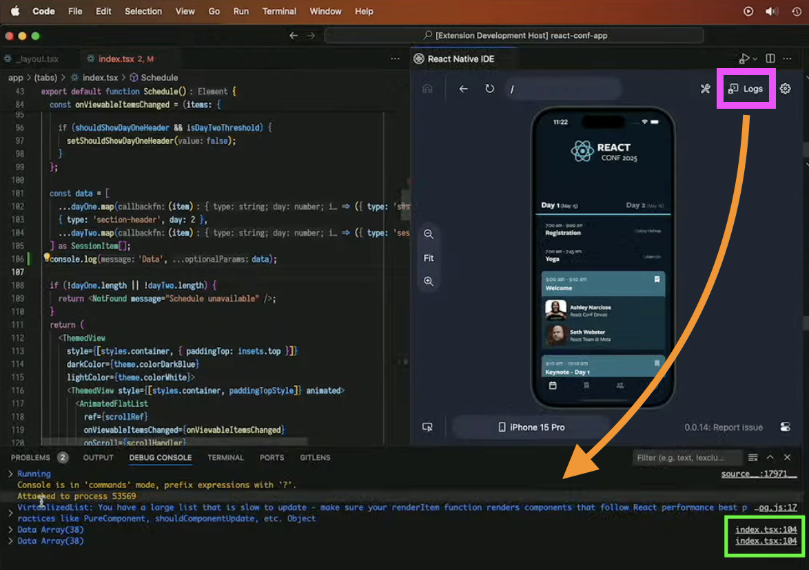
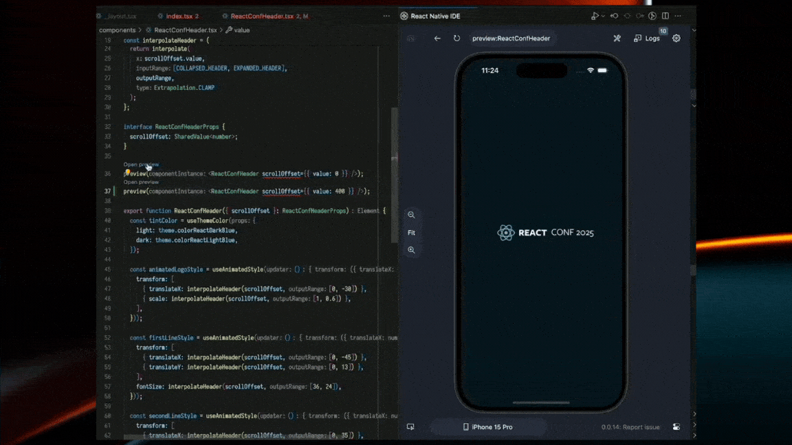
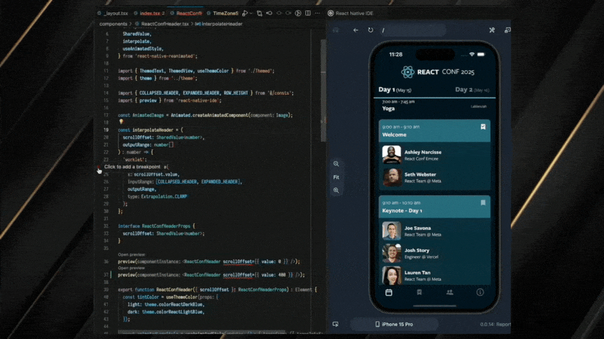

# React Native IDE

Hey React Native Developers,

One of the biggest and most exciting conferences on **React Native**, organized by [**Software Mansion**](https://x.com/swmansion) with [**Expo**](https://x.com/expo) as the main partner and [notJust.dev](https://www.notjust.dev/) as the Media Partner among others, has recently concluded. The three-day event started on May 22nd, filled with exciting announcements. Let’s dive in 🚀

An exciting news is that [**Krzysztof Magiera**](https://x.com/kzzzf), co-founder of [**Software Mansion**](https://x.com/swmansion), has announced the **open beta program** for React Native IDE. It has been 9 months since they began working on it, and they have made significant progress.

### Too much stuff for setting up environment 🤦

When someone starts to build a React Native app using the React Native CLI, they need to perform lots of tasks according to the React Native website to set up the development environment. For example, tons of commands must be installed, **CocoaPods** must be set up, and **Ruby** must be set up with **correct versions**, among other complex tasks, are involved.

### React Native IDE in action 🚀

React Native IDE made it easy for react native developers to set up the environment. The IDE is a Visual Studio Code extension that only runs on macOS now. Below is a screenshot from Visual Studio Code.

Let’s explore the most exciting features of the React Native IDE.

1. Snap Recording
2. Component Inspector
3. Access logs easily
4. Navigation made easier
5. Better Components preview
6. Break Points without any other application 🚀

### Snap Recording

With the React Native IDE, you can record a video capturing 5-7 seconds of the history of your previous interactions within the app, as shown below.

### Component Inspector

You can **left-click** on any JSX component displayed on the device, as shown below, to inspect the component’s **`<View/>`** hierarchy. Clicking on the component will open the corresponding code in VSCode.

### Access logs easily

React Native IDE truly enables you to open all your **logs** in VSCode, as illustrated below.

When you click on the **“Logs”** button at the top right, it will open the log menu at the bottom. Additionally, you can navigate to the corresponding code from each log by clicking on the box indicated in green.

### Navigation made easier

React Native IDE has greatly simplified **navigation**, as shown below. You can view all your **previous navigation history** directly from the IDE. The example below uses the Expo router, which is a file-based routing system.

### Better Components preview

React Native IDE offers a **`preview()`** method that allows you to get a preview of the component you are developing, as shown below 🚀.

### Break Points without any other application 🚀

Another exciting feature is that React Native IDE supports breakpoints. You can even add breakpoints inside native code 🔥.

