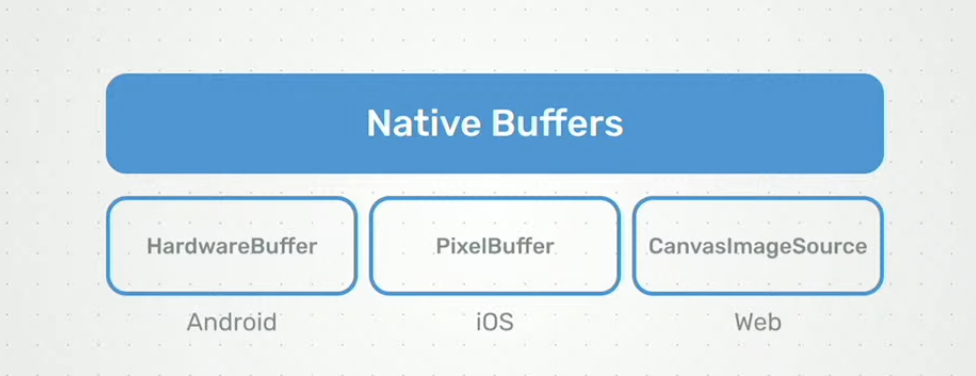
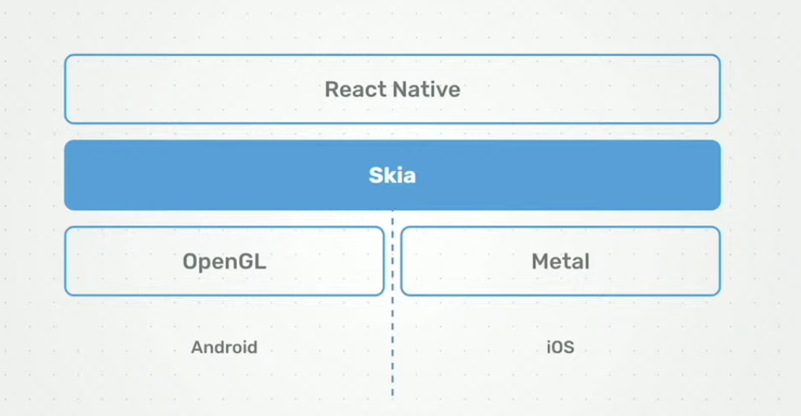

# React Native Skia now with GPU 💥

$\textcolor{chocolate}{\text{\textbf{Posted on Jun 6, 2024}}}$

Hey **React Native 🩵** Developers,

One of the biggest and most exciting conferences, [**App Js Conf 2024**](https://appjs.co/) on **React Native**, organized by [**Software Mansion**](https://x.com/swmansion) with [**Expo**](https://x.com/expo) as the main partner, has recently concluded. The three-day event started on May 22nd, filled with exciting talks. One of the most exciting talks was on **❝ React Native Skia, now with WebGPU ❞**. Today, we will explore more details about it! 🚀

$\textcolor{crimson}{\text{\textbf{NOTE:}}}$ If you want to learn more about all the exciting talks at [**App Js Conf 2024**](https://appjs.co/), then read my detailed [**article**](https://github.com/anisurrahman072/React-Native-News-2024/blob/master/React-Native-Conference-Talks/App-Js-Conf-2024.md) on it.

# Before Start 🙋‍♂️

The **React Native Skia** team [**released V1.0**](https://github.com/anisurrahman072/React-Native-News-2024/blob/master/React-Native-News/React-Native-Skia-V1.0.md) in **March** this year to complete the **drawing features** by providing the **Paragraph API** & **Atlas API**. After that release, the team felt that React Native Skia has the best drawing capabilities, but it should also be able to be used with any **data source** (e.g., Image, Video, 3D projections, etc).

# React Native Skia Video

So, **React Native Skia** already provides a feature where **images** can be rendered using a **shader**. A shader is a small program that runs on the **GPU (Graphics Processing Unit)** and instructs the GPU on how to draw each pixel on the screen. Shaders in Skia are written using Skia’s shading language, similar to GLSL (OpenGL Shading Language). Below is an example of **image shading** using the React Native Skia **Image Shaders API**.

Did you notice that the image pixels were re-rendered when we slid the image from right to left? Yes, that’s the effect of the **Image Shaders API**.

However, this shader was not provided with the video. Therefore, [**William**](https://x.com/wcandillon) announced that from now on, React Native Skia can be applied to **videos** too. Thus, the static image shader examples above can now be applied to videos, and shaders from React Native Skia can be used on **videos** as shown below.

It’s pretty cool, right? From now on, it’s also possible to apply filters and effects to videos using React Native Skia, just like the ones shown below.

Now that we can apply **shaders** to videos as well, it opens the door for **Ambient Mode** (soft glow of colors from the video onto the surroundings of the video) while playing a Video.

# The Native Buffer API

The above React Native Skia Video was developed using a new API named **`Native Buffers`**, created through the collaboration of [**William**](https://x.com/wcandillon) & [**Margelo**](https://x.com/margelo_io) team, led by [**Marc**](https://x.com/mrousavy). It uses **platform-specific** GPU APIs (**Metal** for **iOS** & **OpenGL** for **Android**) which enable **direct GPU access** and data processing for **efficient graphics rendering**, **using** the following memory management classes from different Native SDKs.

- Android uses the “HardwareBuffer” class
- iOS uses the “PixelBuffer” class
- Web uses the “CanvasImageSource” class

**`NOTE:`** **React Native Vision Camera** is now using **React Native Skia**; however, its use is optional. This means you can use the React Native Skia **GPU feature** only when necessary.

# WebGPU: 3D API with React Native Skia

Previously, a significant portion of 3D animation tasks depended heavily on the **CPU**. However, these have now been transitioned to the **GPU**, with examples including 3D transformations (Ex: **Rotating**). Below is the **current architecture** of React Native Skia.

Here, you can see that **`Skia`** runs on top of the **`OpenGL`** GPU API for Android and the **`Metal`** GPU API for iOS. However, have you noticed that this approach wastes a lot of time because the OpenGL GPU code will not work for Metal GPU, and vice versa? Consequently, the React Native Skia team has planned to **modernize this architecture**.

The plan is to implement a **unified 3D API** (**‘WebGPU’**) across both **iOS** and **Android**. Skia will operate on top of this unified API **‘WebGPU’**. This will enable the use of libraries such as **`Three.js`** (used to create and display animated 3D computer graphics) on top of Skia.

Three reasons why **‘WebGPU’** was chosen as the backend for Skia.

1. ⁠It modernized the **React Native Skia** backend API
2. ⁠⁠It creates a unified 3D API across IOS and Android
3. It has the general computing capabilities to run the operations in GPU instead of CPU. Ex: To run an AI model needs high GPU capabilities.

Below is the new architecture of React Native Skia.

Let’s understand each point of this new architecture of React Native Skia 🚀

- Vulkan: It is the new & modern **GPU API for Android**. Previously the team was using OpenGL but it is not supported in the newest Skia backend.
- Metal: Metal is already a **modern GPU API for iOS** & the team is using it from old architecture.
- Dawn WebGPU: It is the C++ implementation of Google **‘WebGPU’**. It reduced 1000 lines of code (by Vulkan or Metal) to 20 lines for a triangle to draw.
- Skia Graphite: It is the new modern backend for modern GPU APIs (Ex: Metal, Vulkan, etc). It is a **high-level graphics library** that focuses on rendering with support for GPU acceleration (offloading compute-intensive tasks from the CPU to the GPU) through Vulkan and other backends.

# That's All 🙋‍♂️

I hope you enjoyed reading it. It would be really great if you could consider giving it a [**STAR**](https://github.com/anisurrahman072/React-Native-News-2024) ⭐️.

# About Author 👷‍♂️

I'm Anis, **Sr. React Native Engineer** and the author of [**React Native Advanced Guide Book**]() with **1.7K STAR** ⭐️. Over 5 years in **React Native** and **Full Stack**, I’ve built numerous production-grade apps. You can **[🩵 CONNECT me in X](https://twitter.com/anis_RNCore)** for any consultation.
