# SDR (Server-Defined Rendering) now in React Native 🌞

$\textcolor{chocolate}{\text{Posted on Aug 1, 2024}}$

Hey **React Native 🩵** Developers,

This week, an exciting conference called [**thegeekconf**](https://x.com/thegeekconf) (powered by [**GeekyAnts**](https://x.com/GeekyAnts)) on React Native and modern web technologies took place in Berlin. One of the great pieces of news is that during the conference, [**Mike**](https://x.com/grabbou) (Founder at [**Xplat Labs**](https://xplatlabs.com/), [**Callstack**](https://x.com/callstackio)) and [**Eric Vicenti**](https://x.com/EricVicenti) (CTO, Seed Hypermedia) presented [**Rise Tools**](https://rise.tools/), which launched just a couple of weeks ago. Since then, it has received a huge response from the React Native community.

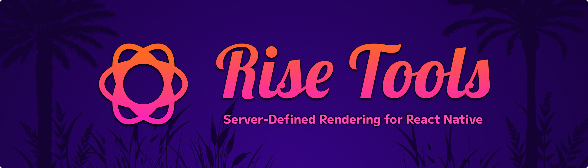

In today’s newsletter, we will explore more details about **Rise Tools** 🛠️.

# Before Rise Tools

To better understand the importance of [**Rise Tools**](https://x.com/risetools_), let’s imagine a **Super Delivery** app that [**Mike**](https://x.com/grabbou) and [**Eric**](https://x.com/EricVicenti) presented on stage.

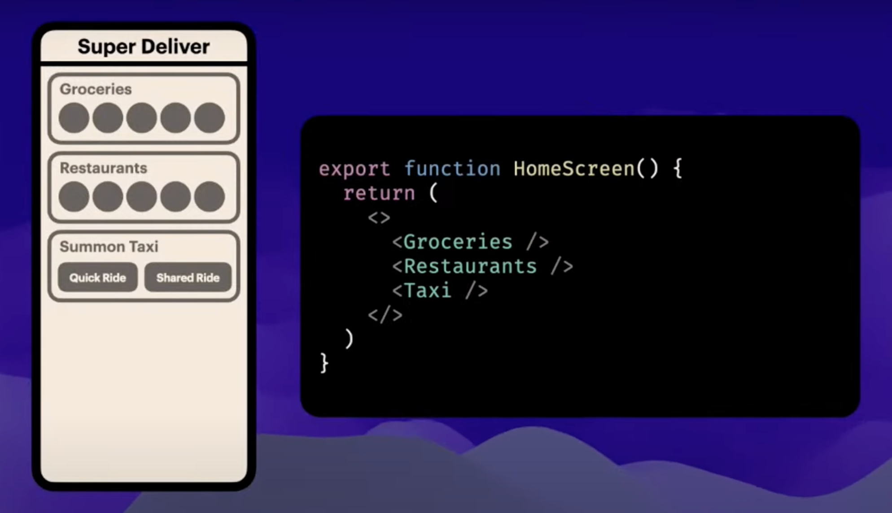

In the image above, we see an app with only three components on the **home screen**, listed in the following sequence:

1. **Groceries** delivery component
2. **Restaurants** (food delivery) component
3. **Taxi** (delivering people) component

Now, imagine that this app is already in the App & Play Store. But what happens if the marketing team asks you to give them the ability to rearrange the home screen components without doing any re-deployment? I guess you are thinking about **CodePush**, right? Unfortunately, CodePush can’t help you too much because we know it still requires some manual work that the marketing team won’t be able to do every time they want to re-arrange the components. Additionally, CodePush can’t do it as fast as the marketing team demands. So, what is the solution? 🤔 (Take a moment to think about it 🤷‍♂️).

Ahh, the marketing team has asked you for another feature. They want the ability to ask users to collect feedback through a form, but they haven’t provided enough time to give you a design for building that form. So, how can it be possible to add a new dynamic UI (form) as per the marketing team’s demand without requiring any redeployment?

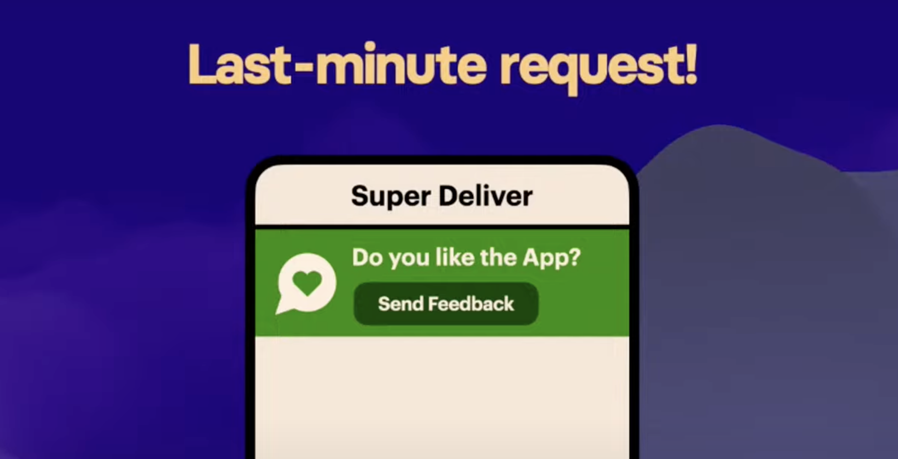

# Rise Tools in action 🔥

In the previous section, our marketing team presented us with two critical requests. The only solution for both of them is [**Rise Tools**](https://rise.tools/), which introduces **Server Defined Rendering (SDR)** in React Native mobile applications.

To better understand **`Rise Tools`** and how it can fulfill both of these requirements, let’s first dive into **SDR**.

### Server Defined Rendering (SDR) 🚀

SDR refers to a rendering approach in which your server provides instructions to your client app (for example, our Super Delivery App) on how the application should display its user interface (UI). SDR can be implemented in both **web** and **mobile** applications.

- **`Web:`** On the web, SDR happens automatically. When you visit a website, the server sends HTML code to your browser. The browser then uses this code to create the visual layout of the page.
- **`Mobile:`** SDR is particularly useful for mobile apps. Imagine you have an app installed on your phone (e.g., Super Delivery App). Now the server sends your defined instructions to the Client App on how to render specific screens or components. As a result, when you need to add a new screen or a new UI update to the production app, you simply update the code on your server, and it automatically updates the Client App UI. The Client App listens to the server using the WebSocket facility, so users won’t be prompted for an app update anymore.

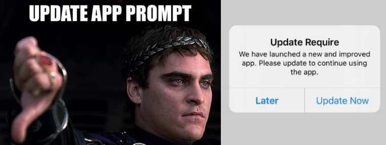

[Picture credit goes to @risetools.](https://rise.tools/docs/intro)

In summary, **SDR** allows you to define components and instructions on the server. The instructions can contain:

- Which components to display?
- How to arrange them?
- What data to fetch from the data server?
- Any dynamic changes (e.g., showing a promotional banner).

**`NOTE:`** SDR is already a very popular technique that is used throughout the industry. We can find many industry apps like below that use this SDR rendering technique in their mobile applications.

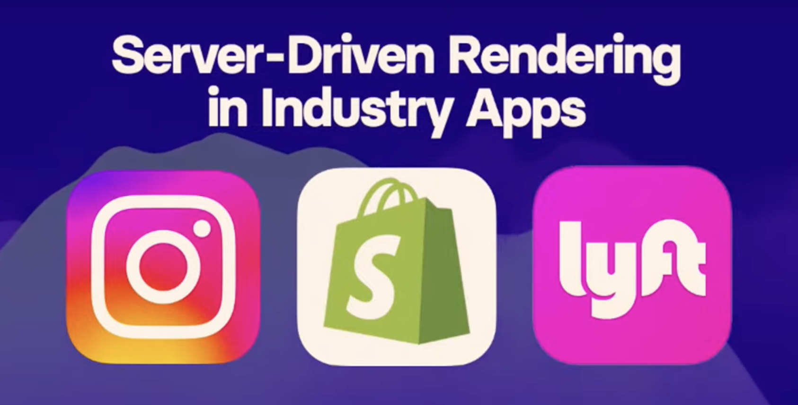

Now, let’s understand how both of the demands from the marketing department can be fulfilled using **Rise Tools**, one by one.

### Solution of First Request (re-arranging home components)

So, currently in our **Client App** (Super Delivery App), we have the **`<HomeScreen/>`** with these three components, as shown below.

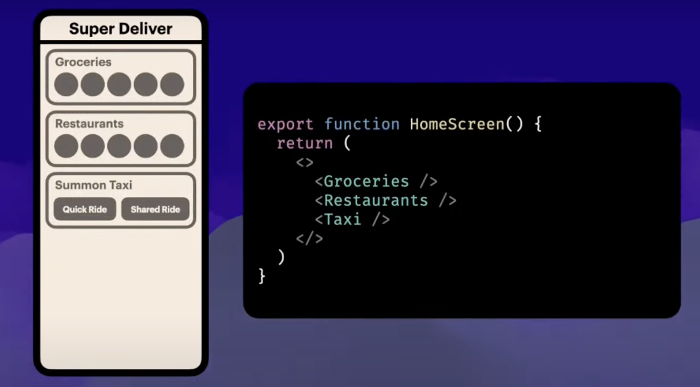

Now, to apply **Rise Tools**, let’s first replace the **`<HomeScreen/>`** with the **`<Rise/>`** component, as shown below.

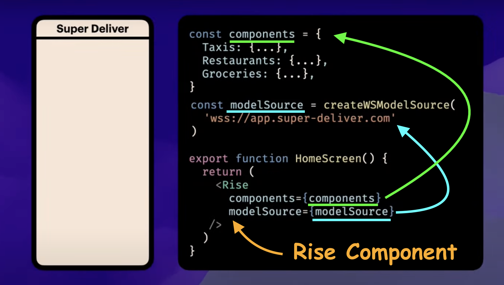

In the **`<Rise/>`** component, we need to pass two props. These are:

1. **`components`:** It is the component registry, which is a map of our client-side components. You will use these components’ key names in **Rise Server** to refer to those client-side components.
2. **`modelSource`:** It connects our client app (Super Deliver App) with our Rise Server, where we will define the instructions.

Now, since we are using **Server-Defined Rendering**, we can define instructions in our **Rise Server** like below.

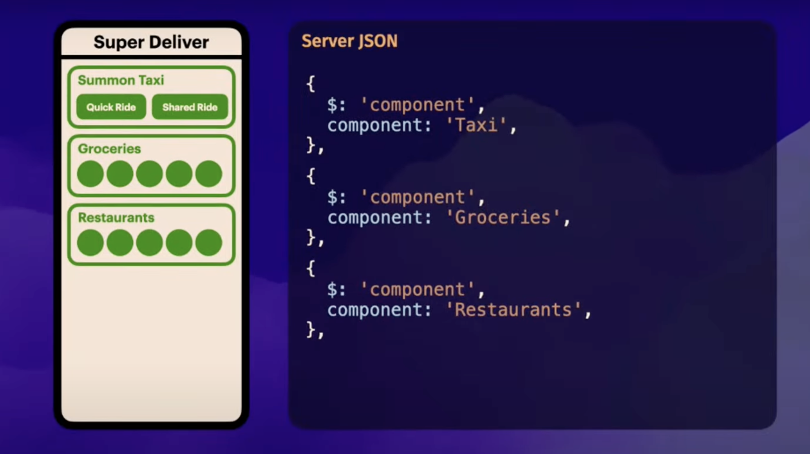

Did you notice that we **rearranged** the JSON on the **`Rise Server`** in the image above? Now the **`<Taxi/>`** component is at the top instead of the **`<Groceries/>`** component. As a result, the Client App also displays the **`<Taxi/>`** component at the top. This is how Rise Tools fulfilled our marketing team’s first request. Pretty cool! 👌

### Solution of Second Request (A feedback component)

To collect feedback data from users, let’s add a **‘Feedback Button’** at the top of the home screen using the **Rise Server** component. This means we need to include the following JSON (shown in the below gif) in our **Rise Server** configuration. The Rise Server will then send this entire JSON (including the button component) to the client app, allowing it to display the ‘Feedback Button’ and its associated icon.

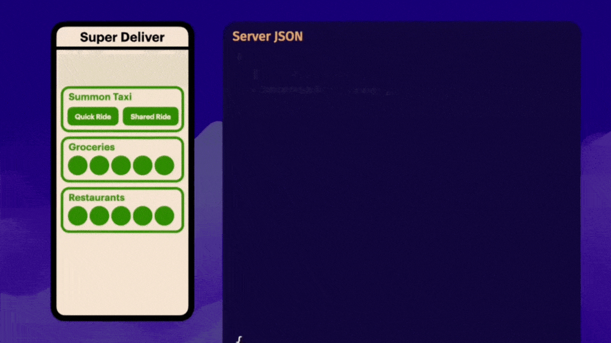

In the GIF above, each JSON line refers to a text or a button in the **Client App** based on its appearance. Now, you need to add an **`action`** and a **`route`** path for the **`onPress`** method in JSON so that the server can instruct the Client App about what will happen when any user clicks on the **‘Send Feedback’** button.

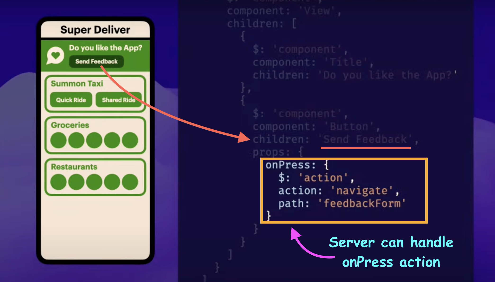

The image above indicates that when the user presses the button with the **`onPress`** event, it will navigate the screen to the **`feedbackForm`** path. That’s great! We’ve completed all the necessary server-related tasks.

Now let’s update our Client App. To do that, we need to add two more props (**`actions`** and **`path`**) to our **`<Rise/>`** component in the Clint App, as shown below.

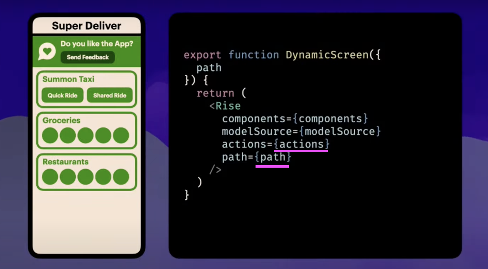

Both of these props, **`actions`,** and **`path`**, receive instructions from the Rise Server (we already showed you the JSON instructions for **`actions`** and **`path`**). Now we only need to build the ‘Feedback Form.’ The Feedback Form will open when a user clicks on the ‘Send Feedback’ button.

Just one thing: before moving into creating the **‘Feedback Form,’** let’s first understand a bit of the Rise Server component’s **style**.

# Rise Tools with Tamagui

In all of the images above, we observed that Mike and Eric demonstrated everything about Rise Server in JSON data format. However, writing JSON directly on the server is not ideal in this modern age. To solve this issue, the team used [**`Tamagui`**](https://tamagui.dev/), a style library for React and React Native. They imported all the necessary components from [**Tamagui**](https://tamagui.dev/) into Rise Tools, allowing you to use these components instead of writing raw JSON. Under the hood, Rise Tools converts your **Tamagui** code to JSON and sends it to the Client App. Below is a code snippet from **Rise Server** where we used a variety of components from Tamagui, enhancing the development process.

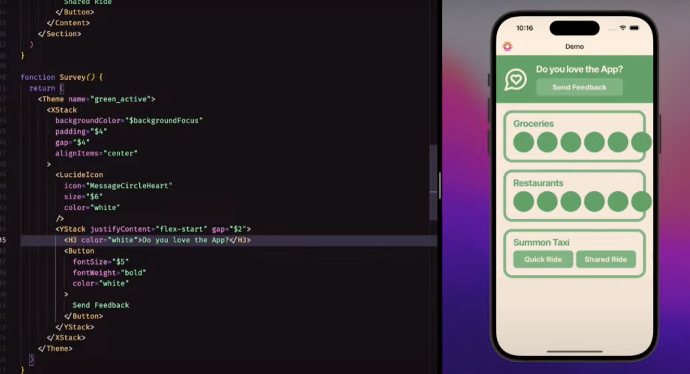

# Complete the Feedback Form 🙌

Now let’s build the Feedback Form component on the **server side** as shown below, using the APIs provided by **Rise Tools** with **Tamagui**.

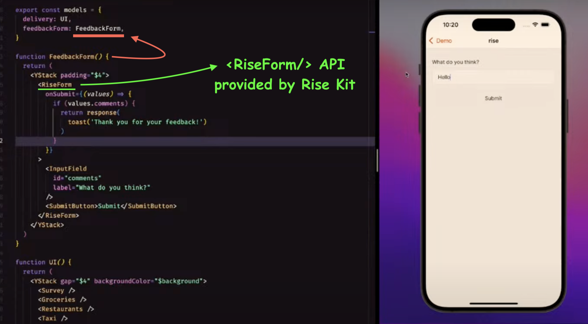

In the image above, we built a new **`FeedbackForm()`** component using **`<YStack/>`** (Tamagui’s vertical Stack). We added **`FeedbackForm`** as a page inside the models definition, with the key **`feedbackForm`** serving as a new route for the Client App (Mike used React Navigation with Expo in the Super Delivery App).

The interesting thing is that **Rise Tools** provides a bunch of very useful APIs, such as the **`<RiseForm/>`**, to build forms in your Rise Server. Super cool, right? Finally, we’ve built the Feedback Form using the awesome tools provided by Rise Kit in a very short time! 🚀

# Rise Kit

It is a set of packages that enable you to deliver production-grade experiences while quickly delivering new features for your users. The team provides these packages with the intention that you can use them in any existing React Native apps. Below are all the available packages in Rise Kit for you now.

- [Kit](https://rise.tools/docs/kit/rise-kit) - It provides high-level components such as Lists and Sheets.
- [Tamagui](https://rise.tools/docs/kit/tamagui) - It delivers the functionality from the [Tamagui](https://tamagui.dev/) component system.
- [Forms](https://rise.tools/docs/kit/forms) - It provides a Rise Form toolkit powered by **Tamagui.**
- [Haptics](https://rise.tools/docs/kit/haptics) - Haptic vibration actions powered by [Expo Haptics](https://docs.expo.dev/versions/latest/sdk/haptics/)
- [Linking](https://rise.tools/docs/kit/linking) - It provides [React Native Linking](https://reactnative.dev/docs/linking) to the browser or settings app
- [Lucide Icons](https://rise.tools/docs/kit/lucide-icons) - You can use any icons from the [Lucide Icon Pack](https://lucide.dev/) in your server components
- [SVG](https://rise.tools/docs/kit/svg) - It is for rendering custom SVGs from your server
- [QRCode](https://rise.tools/docs/kit/qrcode) - It renders QRCodes in your app
- [Tamagui Toast](https://rise.tools/docs/kit/tamagui-toast) - Enables toast UI by [Tamagui](https://tamagui.dev/ui/toast/)

# Create your own Rise Server

Now it’s time to create your own Rise Server. The team has announced that they’ve developed an npm command to set up the entire Rise Server development environment.

```bash
npm create rise
```

After running the command above, the CLI will ask you to provide a name for your Rise Server project, as shown below.

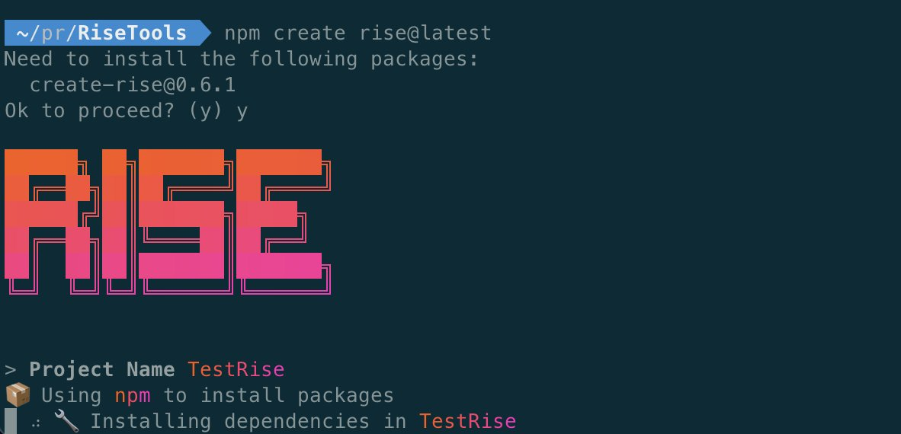

After installing the necessary dependencies, navigate to your project directory using the **`cd`** command, and then execute the following command to run your Rise Server.

```bash
npm run dev
```

If everything goes well, you’ll see an output like the one below 🚀.

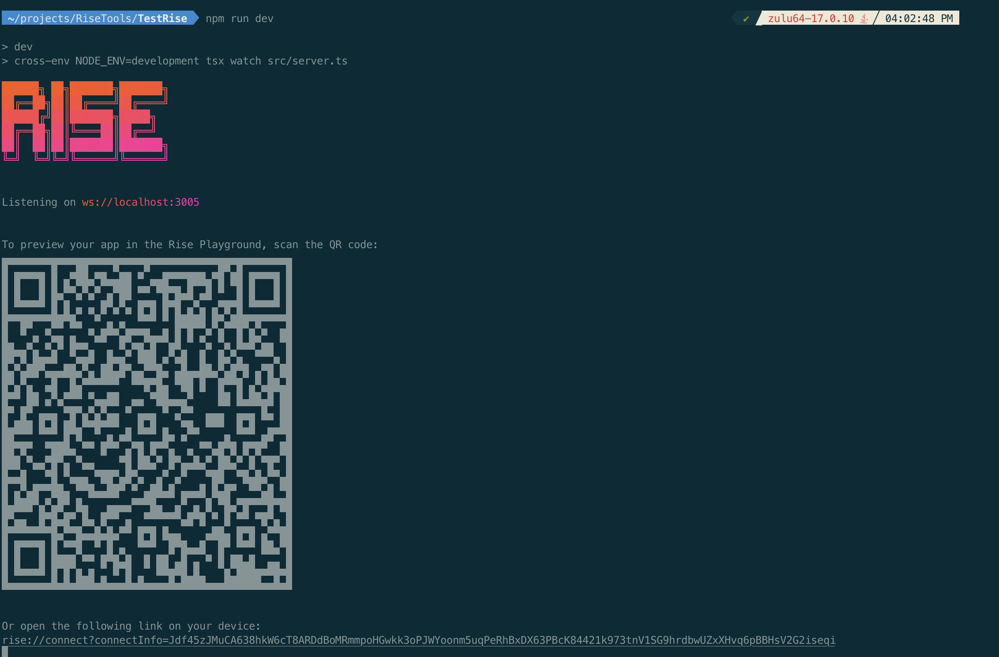

# **Rise Playground**

So, you’ve created your Rise server, and now you want to work with your server code. To do that, the team has developed an exciting tool called the **Rise Playground** (an app available on both the App & Play Store). It allows you to experiment with **Rise tools** and test your server code using all the features from the Rise Kit suite of actions and components. The app connects to your custom server via a URL or QR code, providing a customized mobile experience for your friends and colleagues.


# Other Rendering Processes

Before wrapping up, let’s dive into other rendering processes available in the React and React Native world. Some of the most common and popular rendering techniques include CSR, SSR, RSC, and SDR. In this section, we’ll achieve a clear understanding of each of these.

### Client Side Rendering (CSR)

In this rendering technique, the final HTML content and user interface (UI) components are generated on the client's browser or Mobile app using JavaScript.

Client-side rendering can cause slow performance and SEO issues, so SSR (Server Side Rendering) came to improve loading times and page visibility for search engines.

### Server Side Rendering (SSR)

This rendering technique is used in web development where the web page's content is rendered on the server instead of the client's browser & then sent to the device as JSON (basically HTML) which makes the UX (user experience) faster page transitions & better SEO.

Pretty cool **SSR**, right? But wait, did you notice that in the line above, we mentioned **SSR uses HTML** (a static UI representation)? Yes, that **HTML** is not interactive. So, to create a dynamic and interactive UI, RSC came into the spotlight 💯.

### **React Server Component (RSC)**

In this rendering technique, the Server can send directly JSX components, which are fully interactive & dynamic UI components (Ex: custom sliders), to the client (web, desktop, or Mobile device). A couple of months ago, [**Evan Bacon**](https://x.com/Baconbrix) from the [**Expo**](https://x.com/expo) team introduced **React Server Components** across all platforms (web, desktop, mobile) via the **Expo Router** at **React Conf 2024**. 🎯

Now, consider this: in all CSR, SSR, and RSC, we define our JS components on the client side (e.g., mobile). Yes, that’s why we can’t control the rendering behavior within a second, as demanded by our marketing team. To solve this, Server-Defined Rendering (SDR) comes into play. With SDR, we define components on the server, allowing us to easily control the rendering behavior of the app without rebuilding it.

# That's All 🙋‍♂️

I hope you enjoyed reading it. It would be really great if you could consider giving it a [**STAR**](https://github.com/anisurrahman072/React-Native-News-2024) ⭐️.

# About Author 👷‍♂️

I'm Anis, **Sr. React Native Engineer** and the author of [**React Native Advanced Guide Book**]() with **1.7K STAR** ⭐️. Over 5 years in **React Native** and **Full Stack**, I’ve built numerous production-grade apps. You can **[🩵 CONNECT me in X](https://twitter.com/anis_RNCore)** for any consultation.
