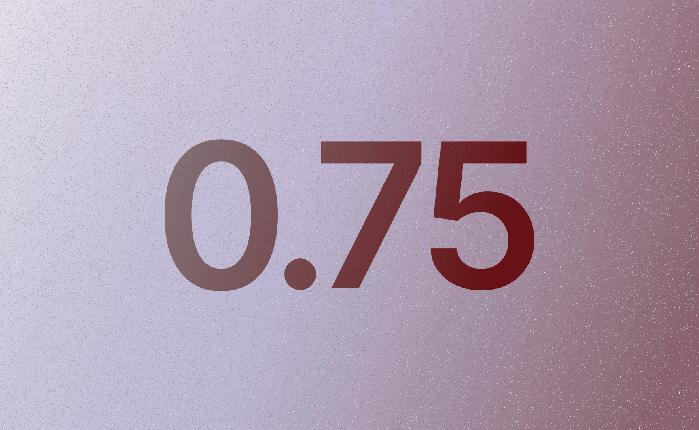
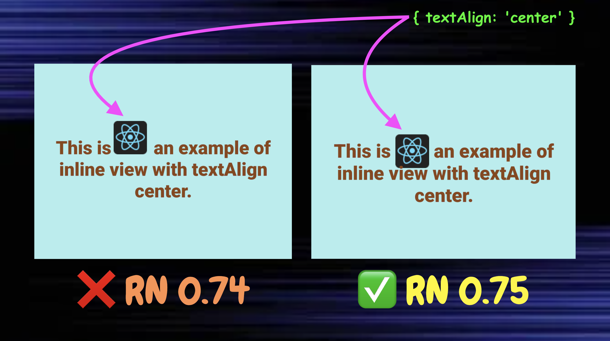
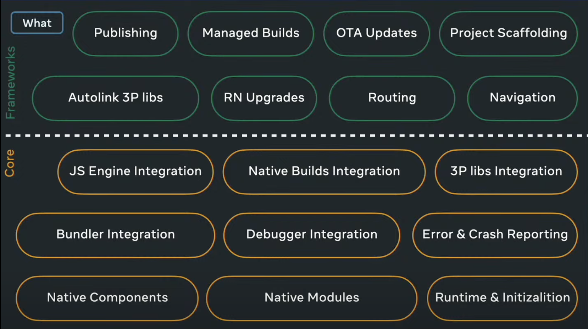

# React Native V0.75 — Stable is out 🚀

$\textcolor{chocolate}{\text{\textbf{Posted on Aug 29, 2024}}}$

Hey **React Native 🩵** Developers,

The most exciting news in React Native is that **V0.75** was released just a couple of days ago with over [**1491 commits**](https://github.com/facebook/react-native/releases/tag/v0.75.0) from **165 contributors 🔥**. Major highlights are:

- **Yoga 3.1**
- **New Architecture Stabilization**
- **Recommendation to use Frameworks**
- **Expo SDK 51 supports**
- **Auto-linking performance improvements**


Picture credit goes to @Expo.

Let’s dive into each of the new highlights.

# **Yoga 3.1**

Let's first understand what **Yoga** is in React Native.

### **Yoga — the layout engine**

**Yoga** is an open-source **layout engine** developed by Meta. The engine is responsible for **how UI elements** (such as buttons, text, images, etc.) are **arranged** and **positioned** within a user interface. **Yoga** calculates these four **layout properties** for each **UI element:**

1. **Positioning**
2. **Sizing**
3. **Alignment**
4. **Spacing**

**Y**ou can create **responsive layouts with Yoga** that adapt to different screen sizes and orientations. It also implements a widely used concept called **CSS Flexbox** in React Native. So you already feel that **yoga** is the heart (♥︎) of React Native flexible UI.

**`NOTE:`** **Yoga 3.0** came out with **React Native 0.74**. You can learn about the new features at my [**News Book 2024**](https://github.com/anisurrahman072/React-Native-News-2024/blob/master/React-Native-News/Yoga-V3.md).

### **What’s new in Yoga 3.1?**

One of the most highly requested features is the support for **`%`** values in various places, such as **gap** properties (e.g., **`gap`**, **`rowGap`**, **`columnGap`**) and **translation** properties (e.g., **`translateY`**, **`translateX`** ). The great news is that **Yoga 3.1** now has this support 🚀.

Today we will explore the code for the **`gap`** property. Let’s take a look at the image below.


Did you notice that the right part of the above image has a perfect **`10%`** gap between each of the three items? Yeah, that’s because it is running on **React Native 0.75** with **`Yoga 3.1`**. However, the left image couldn’t achieve the gap perfectly due to **React Native 0.74** with **`Yoga 3.0`**. Now let’s take a look at the code for the above image.

```jsx
// Component Code
function App() {
  return (
    <View style={styles.container}>
      <View style={styles.innerContainer}>
        <View style={styles.flexItem} />
        <View style={styles.flexItem} />
        <View style={styles.flexItem} />
      </View>
    </View>
  );
}

// Component Styles
const styles = StyleSheet.create({
  container: {
    flex: 1,
    justifyContent: "center",
    alignItems: "center",
    backgroundColor: "lightpink",
  },
  innerContainer: {
    flexDirection: "row",
    width: 200,
    height: 200,
    justifyContent: "space-between",
    gap: "10%", // React Native 0.75 supports % for gap
  },
  flexItem: {
    flex: 1,
    backgroundColor: "dodgerblue",
  },
});
```

In the above code, we used the property **`gap`** with **`%`** for the **`innerContainer`** style, which made that **10%** gap perfectly shown in the above image.

**`NOTE:`** In **React Native 0.75**, the **`gap`** and **`translation`** properties can now accept both **point** and **%** values.

# **New Architecture Stabilization**

Let’s first understand a bit about both the Old & New Architecture of React Native.

### **Old Architecture**

React Native previously used a bridge to communicate between the JavaScript layer and the Native layer. The Native layer is written in C++, Objective C, Java, or kotlin to access native features like cameras, sensors, etc. Unfortunately, the Bridge has some limitations.

One main limitation is that each time one layer communicates with another, it involves **serializing** (converting JS Object to JSON String) and **deserializing** (converting JSON String back to JS Object) data. Since the conversion takes time, this process adds a performance issue to the communication flow.

### **New Architecture in Action 🚀**

The good news is that the React Native team was able to replace the bridge with an interface called JSI (JavaScript Interface). It was written in C++ and it opens up all the native features available to your JS code, which means that you can call native methods without any data serialization or deserialization, making the app super fast. And yeah, this new communication flow is called New Architecture 🙌.

### New Architecture Now in Beta

Since **2018**, the React Native team has been working on the **New Architecture**. In **March 2022**, they made the New Architecture available as an **experimental** option in **React Native 0.68**. Finally, on **May 16** of this year (2024), they promoted the New Architecture from [**experimental** to **`Beta`**](https://github.com/reactwg/react-native-new-architecture/discussions/189). In the Beta phase, the team is working hard to fix bugs and add all missing features to the New Architecture. They also announced that they expect to have a stable release with the New Architecture by the end of 2024.

### What’s New V0.75?

As part of making the New Architecture stable, the team has fixed several bugs in **React Native 0.75**. One of them is “[**`textAlign`** not working with inline views on Android.](https://github.com/facebook/react-native/pull/44146)” The good news is that it has been fixed in **0.75** 🎯. Let’s take a look at the image below.



In the above image, we see **text** with an **image (react native logo)** as an inline view (meaning in the same line). To improve the UI, it is natural to want the **logo** to be centered along with the text when applying the **`textAlign`** property as the **`center`**. However, you may notice that on the left side of the above image, the React Native logo is not properly centered with the text, while on the right side, it is perfectly **centered** because of **React Native 0.75**. Amazing, right? Below is the code for the above image.

```jsx
// Component Code
function App() {
  return (
    <Text style={styles.text}>
      This is
      <Image source={{ uri: "REACT_NATIVE_LOGO_URL" }} style={styles.image} />
      an example of inline view with textAlign center.
    </Text>
  );
}

// Component Style
const styles = StyleSheet.create({
  text: {
    textAlign: "center", // This now works correctly with inline views
  },
  image: {
    width: 50,
    height: 50,
  },
});
```

# **Recommendation to use Frameworks**

Earlier this year at the [**React Conf**](https://conf.react.dev/), the React Native team recommended the way to build a React Native app is now through a [**framework**](https://reactnative.dev/blog/2024/06/25/use-a-framework-to-build-react-native-apps), such as Expo. Let’s get back to the stage 🚀.

### Why need a Framework?

To understand the importance of a framework, [**Nicola Corti**](https://x.com/cortinico) from Meta presented an amazing talk at [**App.js Conf 2024**](https://appjs.co/) just a couple of months ago. He showed us a chart that presents what the **Core** of React Native can do and what a **Framework** (such as Expo) can do. Let’s take a look at the chart below.



From the above image, the brown sections show the responsibilities of the Core of React Native, and the green sections show the responsibilities of a Framework. At the present moment, we are very lucky that the Expo team has created a production-grade framework for us, which provides all the necessary tools (mentioned in the chart above) to make our app ready for the Apple and Play Stores without any hassle. Finally, we can recall a quote from the stage of React Conf, which highlights the need for a framework.


### Changes for the Recommendation 💁‍♂️

So, to make the recommendation of using [**Expo**](https://expo.dev/) more appropriate, the React Native team has announced the sunset of the **`react-native init`** command as of December 31st, 2024. The team mentioned that instead of the init command, you can start with [**Expo**](https://docs.expo.dev/get-started/create-a-project/).

**`NOTE:`** The **`react-native init`** command is used to create a new React Native project from scratch without any frameworks.

# **Expo SDK 51 supports**

We can now say that **Expo** is an integral part of React Native, as it is the [**only react native framework**](https://reactnative.dev/blog/2024/06/25/use-a-framework-to-build-react-native-apps) with huge popularity due to its complete package of production-grade app development tools. The **Expo** team also sees this and has quickly added support for **React Native 0.75** with **Expo SDK 51**. Special thanks to [**Gabriel Donadel**](https://x.com/donadeldev).

**`NOTE:`** The **default** React Native version for **Expo SDK 51** will continue to be **0.74**. However, you can choose to use **0.75** with **Expo SDK 51** by following the steps mentioned [**here**](https://expo.dev/changelog/2024/08-14-react-native-0.75#how-to-use-react-native-075-with-expo-sdk-51).

# **Auto-linking performance improvements**

To understand better, let’s first understand a bit of Auto-linking.

### What is Auto-linking?

Auto-linking is a feature introduced in **React Native 0.60** that simplifies the process of **linking** native modules (connecting native code with JS code) to your React Native project. Before **`Auto-linking`**, when you added a new library, you would need to manually link it to your project using tools like **CocoaPods** for **iOS** or **Gradle** for **Android**. **Auto-linking** automates this process, making it easier to install any native modules (libraries) with a simple install command without additional configuration.

### Two Steps of Auto-linking

When a developer runs an **npm** or **yarn** command to install a **native module** package into a React Native app, the package is first downloaded into the app’s  **`node_modules`** directory. After the installation is complete, the **auto-linking** process starts. This auto-linking process is completed in **two** steps.

1. **`Discovery Process Step:`** This process again has two steps.
   1. **`Scanning:`** Right after the native module is downloaded, the **core** of React Native scans your entire project to find the newly added library.
   2. **`Identifying:`** After scanning, the **core** of React Native identifies the newly installed library and gathers information about it, such as its configuration and dependencies.
2. **`Code Generation Step:`** Once the **discovery process** is complete, the **core** of React Native now generates the necessary code to link the library’s **native code** to your project’s **JS code**.

### Performance Boost in 0.75

As **Expo** is the only recommended framework by the **React Native team**, both teams made a great decision to split the responsibility of **auto-linking** into two parts, which created a significant performance boost. From now on, the **`Discovery Process Step`** (shown above) will be handled by the **Expo** framework, and the **`Code Generation Step`** will be managed by the **core** of React Native 🔥.

If you are using the latest **Expo SDK 51** in your projects, you can enable this new **auto-linking** feature (performance boost) by setting the [**environment variable**](https://docs.expo.dev/guides/environment-variables/) **`EXPO_UNSTABLE_CORE_AUTOLINKING=1`**.

### Performance Benchmark

With **Expo SDK 51** and **React Native 0.75**, the auto-linking step for React Native libraries (which are not [**Expo modules**](https://docs.expo.dev/modules/overview/)) is now faster — up to **~6.5x faster** on **Android** and **~1.5x faster** on **iOS**. Let’s try it today 🚀.

# That's All 🙋‍♂️

I hope you enjoyed reading it. It would be really great if you could consider giving it a [**STAR**](https://github.com/anisurrahman072/React-Native-News-2024) ⭐️.

# About Author 👷‍♂️

I'm Anis, **Sr. React Native Engineer** and the author of [**React Native Advanced Guide Book**]() with **1.7K STAR** ⭐️. Over 5 years in **React Native** and **Full Stack**, I’ve built numerous production-grade apps. You can **[🩵 CONNECT me in X](https://twitter.com/anis_RNCore)** for any consultation.
