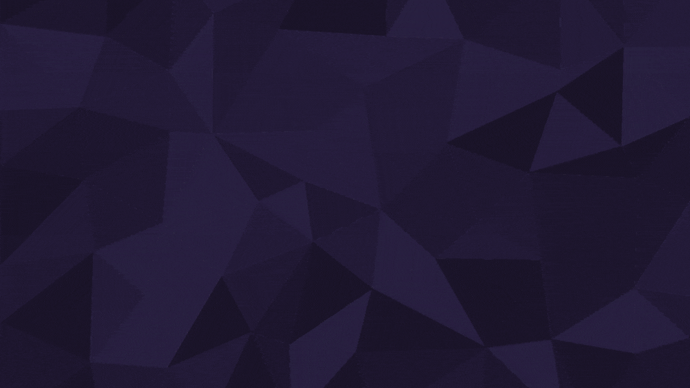
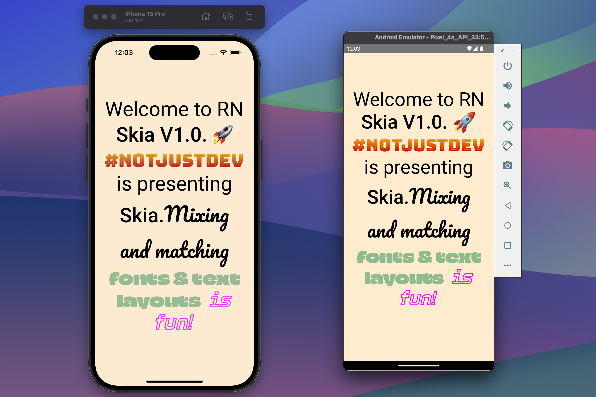
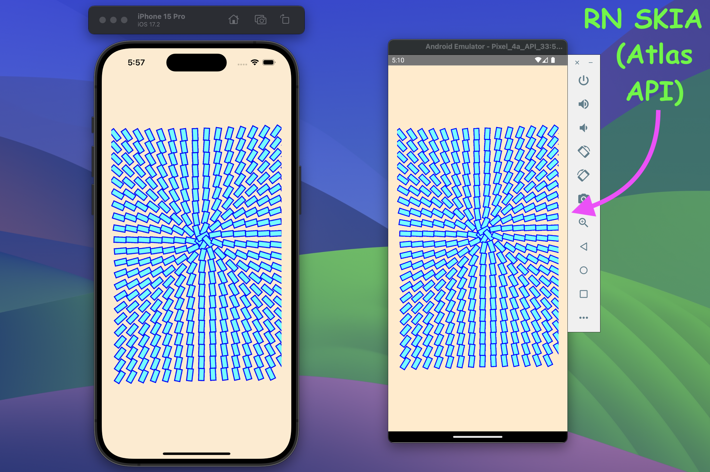

# Empowering Creativity: React Native Skia 1.0 Adds 5 Exciting Features for Animators

Hey **notJust** Developers,

Exciting news in the world of **React Native Animation**: The Skia team recently published React Native Skia version **1.0**, a significant milestone achieved just 3 weeks ago. In this first-ever stable release, they’ve unveiled 5 super exciting features and enhancements.

Let’s deep dive into each of the features & enhancements in this newsletter. Below are all the new features and enhancements in a concise manner.

1.  **Rich Text Layouts using the New Paragraph API**: This feature enables rich text formatting using the new Paragraph API.

2.  **Animation Hooks**: These hooks provide the easiest and fastest way to build animations in Skia.

3.  **The Atlas API**: The Atlas component is used for the efficient rendering of multiple instances of the same texture or image.

4.  **Efficient Lottie Animations with RN Skottie and RN Skia:** This feature allows efficient integration of Lottie animations within React Native Skia.

5.  **Canvaskit-js**: A small but promising library for web development, delivering rich web experiences with React Native Skia while maintaining a very small bundle size.

In this Issue, we’ll explore the new Paragraph API and the fresh Atlas API of React Native Skia, and then proceed to create the following animations.



Before diving into the details of each feature & enhancement, let’s understand some basics about Skia & React Native Skia.

## The Skia Library

Skia is an open-source 2D graphics library that provides common APIs that work across a variety of hardware and software platforms. It serves as the graphics engine for Google Chrome and ChromeOS, Android, Flutter, and many other products.

## Skia is now in React Native

React Native Skia brings the **Skia Graphics Library** to React Native. It has been built by the **Shopify** team on top of the Skia Library.

One of the main differences between Flutter & React Native is that, Flutter has control over pixels but the big downside is Flutter doesn’t have control over Native Views. On the other hand, React Native has control over Native Views but it loses control over Pixel.

What **“React Native Skia”** did here is that it gives React Native control over Pixels too now. Besides this, by “React Native Skia” you can apply effects on **Native Views** and capture the pixels of Native views too.

## Unveiling the Potency of “React Native Skia”

There is tremendous potential in React Native Skia. Let’s explore some common but very crucial capabilities of React Native Skia.

- “React Native Skia” is using **JSI**. JSI (Javascript Interface) is written in C++ & it is the new architecture model in React Native which dropped the old **“Bridge”** architecture from React Native. JSI brought a **direct**, **native interface** to **JavaScript** objects and functions. As “React Native Skia” uses JSI it can expose C++ objects to Javascript & which makes React Native Skia very faster.

- **“React Native Skia”** also uses **“Reanimated**”, which was created by Software Mansion. **“Reanimated”** enables developers to create smooth animations and interactions that run natively on the **UI thread**. In React Native, there are **two threads** specifically used: 1) JS thread and 2) UI (Native) thread. When animations can run on the **UI thread**, they become very speedy due to native performance. Since **“Reanimated”** can run animations on the **UI thread** and **“React Native Skia”** uses **Reanimated**, so “React Native Skia” can run animations on the UI (Native) thread which makes it super fast.

## **Install React Native Skia**

To add React Native Skia, you are required to have this react-native@>=0.66 and react@>=18 support in your app. Now enter this below command to install React Native Skia.

```bash
    yarn add @shopify/react-native-skia
```

## Let’s dive into new features & enhancements.

### Rich Text Layouts with the New Paragraph API

From day one, React Native Skia was able to display text, but it was not possible to automatically break lines, apply layouts, or mix and match system fonts with custom app fonts. And this is what the Paragraph API now does.

The **Paragraph API** in React Native Skia allows you to create sophisticated text layouts with ease. Whether you’re building a chat app, a document viewer, or any other text-heavy interface, this feature will come in handy.

Let’s start by creating the below paragraph using custom fonts.



To do this you have to add one or two custom fonts in your React Native app. For your information, we will use **“Roboto”** & **“BungeeSpice”** fonts for this example.

First of all, let’s import dependencies from RN Skia SDK.

```javascript
// Imports
import {
  Paragraph,
  Skia,
  useFonts,
  TextAlign,
  Canvas,
} from "@shopify/react-native-skia";
```

Now load your custom fonts.

```javascript
// imports ...

// Build a component to render paragraph with custom fonts
export default function RichText() {
  // Load custom fonts
  const customFontMgr = useFonts({
    Roboto: [
      require("../../assets/fonts/roboto/Roboto-Regular.ttf"),
      require("../../assets/fonts/roboto/Roboto-Medium.ttf"),
    ],
    Bungee: [require("../../assets/fonts/bungee/BungeeSpice-Regular.ttf")],
  });
}
```

Then build the paragraph using “Skia.ParagraphBuilder” with the above custom fonts that we loaded.

```javascript
// Imports ...

// Build a component to render paragraph with custom fonts
export default function RichText() {
  // Load custom fonts ...

  // Build paragraph
  return Skia.ParagraphBuilder.Make(paragraphStyle, customFontMgr)
    .pushStyle(textStyle)
    .addText("Welcome to RN")
    .pushStyle({ ...textStyle, fontStyle: { weight: 500 } })
    .addText(" Skia V1.0. 🚀")
    .pushStyle({ ...textStyleBungee })
    .addText(" #NotJustDev")
    .pushStyle({ ...textStyle })
    .addText(" is presenting ")
    .pushStyle({ ...textStyle, fontStyle: { weight: 500 } })
    .addText("Skia.")
    .pop()
    .build();
}
```

You see we added styles **“paragraphStyle”**, **“textStyle”** & **“textStyleBungee”**. Now let’s see how we added those styles inside **\<RichText>** the component.

```javascript
// Imports ...

// Build a component to render paragraph with custom fonts
export default function RichText() {
  // Load custom fonts ...

  // Define styles
  const paragraphStyle = {
    textAlign: TextAlign.Center,
  };
  const textStyle = {
    color: Skia.Color("black"),
    fontFamilies: ["Roboto"],
    fontSize: 50,
  };
  const textStyleBungee = {
    color: Skia.Color("black"),
    fontFamilies: ["Bungee"],
    fontSize: 45,
  };

  // Build paragraph ...
}
```

Now call this \<RichText /> component from anywhere in the app. You will see an output like below.


Below is the full code together to build paragraphs using custom fonts.

```javascript
// Imports
import { useMemo } from "react";
import {
  Paragraph,
  Skia,
  useFonts,
  TextAlign,
  Canvas,
} from "@shopify/react-native-skia";
import {
  widthPercentageToDP as wp,
  heightPercentageToDP as hp,
} from "react-native-responsive-screen";

// Build a component to render paragraph with custom fonts
export default function RichText() {
  // Load custom fonts
  const customFontMgr = useFonts({
    Roboto: [
      require("../../assets/fonts/roboto/Roboto-Regular.ttf"),
      require("../../assets/fonts/roboto/Roboto-Medium.ttf"),
    ],
    Bungee: [require("../../assets/fonts/bungee/BungeeSpice-Regular.ttf")],
  });

  // Used memo so that the paragraph is not built multiple times.
  const paragraph = useMemo(() => {
    if (!customFontMgr) {
      return null;
    }

    // Define styles
    const paragraphStyle = {
      textAlign: TextAlign.Center,
    };
    const textStyle = {
      color: Skia.Color("black"),
      fontFamilies: ["Roboto"],
      fontSize: 50,
    };
    const textStyleBungee = {
      color: Skia.Color("black"),
      fontFamilies: ["Bungee"],
      fontSize: 45,
    };

    // Build paragraph
    return Skia.ParagraphBuilder.Make(paragraphStyle, customFontMgr)
      .pushStyle(textStyle)
      .addText("Welcome to RN")
      .pushStyle({ ...textStyle, fontStyle: { weight: 500 } })
      .addText(" Skia V1.0. 🚀")
      .pushStyle({ ...textStyleBungee })
      .addText(" #NotJustDev")
      .pushStyle({ ...textStyle })
      .addText(" is presenting ")
      .pushStyle({ ...textStyle, fontStyle: { weight: 500 } })
      .addText("Skia.")
      .pop()
      .build();
  }, [customFontMgr]);

  // Render the paragraph
  return (
    <Canvas
      style={{
        width: wp(90),
        height: hp(70),
      }}
    >
      <Paragraph paragraph={paragraph} x={0} y={0} width={wp(90)} />
    </Canvas>
  );
}
```

Let’s get a review of other new features & enhancements of React Native Skia V1.0.

### **New Animation Hooks**

These hooks provide the easiest and fastest way to build animations in Skia. Below are animation hooks that RN SKIA provided when using React Native Skia with Reanimated.

1.  **usePathInterpolation**: This hook smoothly **interpolates** between different path values based on a **progress value**. Imagine you have two different shapes (paths), and you want to transition smoothly from one to the other. usePathInterpolation makes this happen seamlessly.

2.  **usePathValue:** This hook offers an **easy way to animate paths**. Behind the scenes, it optimizes everything for efficiency. Imagine you’re creating a weather app, and you want to animate a raindrop falling from the sky. usePathValue ensures that raindrop glides down gracefully, without any hiccups.

3.  **useClock:** This hook returns a **time value in milliseconds** since it was activated. Let’s think of it as a digital stopwatch that starts ticking when your component mounts. You can use this time value for various purposes, such as creating time-based animations or scheduling events.

4.  **useRectBuffer:** This hook creates an **array of rectangles** to be animated. If your component needs to handle multiple rectangles (maybe for a game grid or UI layout), useRectBuffer simplifies the process. It’s like having a stack of virtual sticky notes you can move around.

### **The Atlas API**

The **Atlas component** in React Native Skia is like a magical backpack for textures or images. It helps you efficiently render multiple instances of the same texture (think: sprites) with varying transformations.

Imagine you’re drawing a bunch of similar objects, like game characters or UI elements, and you want them to move, rotate, or scale smoothly. The Atlas API has your back!

The Atlas component has 3 major attributes. These are below 👇

1.  **Image**: You load an image (your texture) into the Atlas. This could be anything — a cute cat, a spaceship, or even a slice of pizza (because why not? 🍕).

2.  **Sprites**: Next, you define where these sprites (pieces of your image) are located within the Atlas. Each sprite corresponds to a specific part of your texture.

3.  **Transforms**: You apply transformations (like rotation, scaling, or translation) to each sprite. These transformations make your sprites dance, fly, or do whatever you need them to do.

Let’s create an **Atlas** component like below & understand each of its parts.



First of all, import all the dependencies.

```javascript
// Imports
import React from "react";
import {
  Skia,
  drawAsImage,
  Group,
  Rect,
  Canvas,
  Atlas,
  rect,
} from "@shopify/react-native-skia";
```

Now, we’re creating an **image** (a rectangle shape) that contains **two** rectangles by using \<Rect /> — one **cyan**-filled and the other **blue**-bordered.

```javascript
// Imports....

// Create an Image (Rectangle shape)
const size = { width: 25, height: 11.25 };
const strokeWidth = 2;
const imageSize = {
  width: size.width + strokeWidth,
  height: size.height + strokeWidth,
};
const image = drawAsImage(
  <Group>
    <Rect
      rect={rect(strokeWidth / 2, strokeWidth / 2, size.width, size.height)}
      color="cyan"
    />
    <Rect
      rect={rect(strokeWidth / 2, strokeWidth / 2, size.width, size.height)}
      color="blue"
      style="stroke"
      strokeWidth={strokeWidth}
    />
  </Group>,
  imageSize
);
```

Then below, we’re creating an array called sprites. The array will have numberOfBoxes elements (in this case, 350). Each element represents a **sprite**, which is like a cutout from our image (those rectangles or circles we want to animate). The **rect(0, 0, imageSize.width, imageSize.height)** function creates a sprite with a specific size (width and height).

```javascript
// Imports....

// Create an Image (Rectangle shape)....

// Create the <ImageWithAtlas /> component to render Atlas Images
export default ImageWithAtlas = () => {
  // Create 350 sprites (350 Rectangles)
  const numberOfBoxes = 350;
  const sprites = new Array(numberOfBoxes)
    .fill(0)
    .map(() => rect(0, 0, imageSize.width, imageSize.height));
};
```

After that, now we’re creating another array called transforms. Each element in this array represents a **transformation** for a corresponding sprite.

```javascript
// Imports....

// Create an Image (Rectangle shape)....

// Create the <ImageWithAtlas /> component to render Atlas Images
export default ImageWithAtlas = () => {
  // Create 350 sprites (350 Rectangles)....

  // Create transformation rules for each sprites
  const pos = { x: 190, y: 258 };
  const width = 400;

  const transforms = new Array(numberOfBoxes).fill(0).map((_, i) => {
    const tx = 5 + ((i * size.width) % width);
    const ty = 25 + Math.floor(i / (width / size.width)) * size.width;
    const r = Math.atan2(pos.y - ty, pos.x - tx);
    return Skia.RSXform(Math.cos(r), Math.sin(r), tx, ty);
  });
};
```

In the above transformation code, we used some calculations. Let’s try to understand them a bit.

- The **pos** is the center point, and sprites (rectangles) will **circulate** this center point.

- The **tx** and **ty** values determine the **position** (translation) of each sprite (each rectangle in this case).

- The **r** value calculates the rotation **angle** based on the sprite’s position relative to the center point (pos).

Now bringing It all together through \<Atlas /> API.

```javascript
// Imports....

// Create an Image (Rectangle shape)....

// Create the <ImageWithAtlas /> component to render Atlas Images
export default ImageWithAtlas = () => {
  // Create 350 sprites (350 Rectangles)....

  // Create transformation rules for each sprites....

  // Finally create & return the Atlas component to render 350 sprites
  return (
    <Canvas
      style={{
        width: wp(100),
        height: hp(60),
      }}
    >
      <Atlas image={image} sprites={sprites} transforms={transforms} />
    </Canvas>
  );
};
```

Now you can call the \<ImageWithAtlas /> component from anywhere in your app & you will see an output like below.


### Efficient Lottie Animations with RN Skottie and RN Skia

For scripted (**Guided Movements**) animations, **React Native Skia** serves as the foundation for **React Native** **Skottie** by providing the necessary infrastructure for rendering graphics. **React Native** **Skottie** has been created by **Margelo**.

When you use **react-native-skottie** in your **React Native** app, it internally relies on **@shopify/react-native-skia**. When you load a **Lottie animation** (either from a JSON file or a DotLottie file), **@shopify/react-native-skia** processes it and hands it over to **Skottie**. **Skottie** then takes care of rendering the animation efficiently using **Skia’s GPU acceleration**. The result is incredibly smooth and performant animations within your React Native app!

It is very simple to use Skottie in your React Native App.

```javascript
// Imports
import { Skottie } from "react-native-skottie";
import LottieAnimationFile from "./animation.json";

// Return the component to render with Skottie animation
export default function App() {
  return (
    <Skottie
      style={styles.flex1}
      source={LottieAnimationFile}
      autoPlay={true}
    />
  );
}
```

### Introducing Canvaskit-js: Enhancing Web Experiences with React Native Skia

The React Native Skia team is excited to announce the release of **Canvaskit-js**, an open-source library designed for web development. This lightweight yet powerful library enables you to create **rich web experiences** using **React Native Skia**, all while keeping your bundle size impressively small — just **20 kilobytes**!

# That’s it 🙌

In a nutshell, React Native Skia V1.0 brings five fresh features to the table. Get ready for an exciting ride!

### 🙏 If you find my R&D helpful, please give a STAR ⭐️
